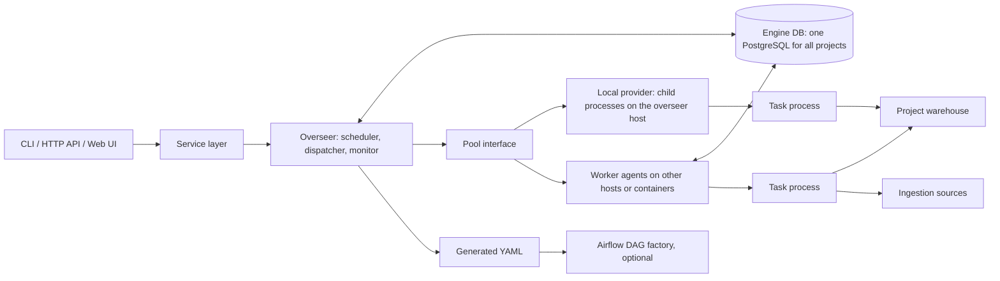
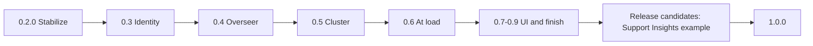

# Road to 1.0.0

This is the build plan from 0.1.0 to 1.0.0. It is written so that an engineer who has not worked on
etl-craft before can pick up any work item, find the code it touches, make the change, write the
tests that prove it, and know when it is done.

It combines two code reviews of 0.1.0 plus the merged pause, backfill, consumption-log and
catalog-history work: a three-pass review that reproduced 65 defects on SQLite, PostgreSQL, DuckDB,
DuckDB over Iceberg and Trino, and an independent review that contributed the gate-provenance,
release-gate, reserved-step-name and hidden-file findings and the worker-pool contract. Every defect
is listed with its fix in [Appendix A](#appendix-a-defect-traceability).

## How to use this plan

**Read first.** `CLAUDE.md` (layers, design rules, conventions), `CONTRIBUTING.md` (definition of
done) and [the rewrite plan](rewrite-plan.md) (how the codebase is organised and tested). The
sections [Target architecture](#target-architecture) and
[The run and attempt state machine](#the-run-and-attempt-state-machine) define the vocabulary used
everywhere below.

**Work items.** Each release is split into workstreams (for example `S2.A`), and each workstream into
items (`S2.A.3`). Every item has the same parts:

- **Problem**: what is wrong or missing, with the defect ids it closes (`B23`, `W11`).
- **Where**: the files and functions involved. Line numbers drift; search for the function name.
- **Change**: what to build, specific enough to implement. Code shown is a sketch of the shape, not
  copy-paste-ready code: follow the module's existing style.
- **Tests**: the tests to add. Each must fail before the change and pass after it.
- **Done when**: the observable acceptance criteria.

**Branches.** One branch per workstream, or per item when an item is large, named
`<type>/<area>-<topic>` as `CONTRIBUTING.md` requires (for example `fix/execution-run-admission`).
Squash-merge by pull request. A release is cut when every workstream in it is merged and its gate
passes.

**Definition of done for every item** (in addition to `CONTRIBUTING.md`):

1. The tests named in the item exist, carry their suite marker, and fail on the old code.
2. `make check` passes, and the suites the item touches pass against the local services
   (`make services-up`).
3. User-facing behaviour changes are reflected in `docs/` (guides and reference) in the same pull
   request, and in `CHANGELOG.md` under `[Unreleased]`.
4. Engine DB changes ship as a migration in both `dialects/engine/postgres/migrations/` and
   `dialects/engine/sqlite/migrations/`, the fresh `schema.sql` files are updated to match, and the
   upgrade test passes from every released schema in `tests/fixtures/schemas/`.
5. New error classes get the next free `ExitCode` (today the last is `INJECTED_FAULT = 19`).
6. Every failure the item introduces names the object, the value found, what was expected and the
   remedy, and is recorded on the run or attempt it belongs to.

**Severity words.** *High*: possible wrong data, wrong run state or a security exposure under normal
use. *Medium*: a feature fails or behaves surprisingly in a realistic case. *Low*: an edge case or a
diagnostics problem.

## Progress

Update this table in the pull request that finishes a workstream, and record in
[Handover notes](#handover-notes) anything a later item must know: a choice that differs from the
item's text, or work done early under another item.

| Workstream | Status | Pull request | Closes |
| --- | --- | --- | --- |
| S2.A Run admission and finalization | Done | #78 | B2, B4, B7, B10, B13, B15, B23 to B32 |
| S2.B Signals and the task process | Done | #79 | B3, B53, B54 |
| S2.C Real transactions on SQLite | Done | #77 | B18 |
| S2.D SQL action guards | Done | #80 | B5, B12, B17, B21, B34, B41, B42, B44, B45, B46; B57 for SQL actions and rules |
| S2.E The ingestion script contract | Done | #82 | B19, B60 |
| S2.F Alerts and SMTP | Done | #83 | B20, B50, B61 |
| S2.G Configuration and secrets | Done | #84 | B48, B49, B55, B56, B58, B59 |
| S2.H Export and publishing | Done | #85 | B47, B64, B65 |
| S2.I A release gate that checks completeness | Done | #86 | B63 |
| S2.J Business rules at size | Done | #87 | B51; B57 done in S2.D |
| S2.K Migrations and small fixes | Done | #88 | B33; S2.K.5 done in S2.A |
| S2.L Regression suite and release | Done | #90, #91, #92, #93 | 48 stabilization defects; 0.2.0 released |
| S3.A Identity schema | Done | #95 | Run identities, attempt history and gate-decision schema |
| S3.I Actors and engine-only writes | Done | #98 | W15 |
| S3.B Centralized transitions | Done | #99 | Guarded lifecycle writes and immutable live attempts; ownership/reconciliation completes in S3.D |
| S3.C Explicit run selection | Done | #100 | B11, B16, W11 |
| S3.D Leases and reconciliation | Done | #101 | B1, B8, B16, B24, B26, W1 |
| S3.E Recorded gate decisions and repairs | Done | #102 | B14, B62 |
| S3.F Atomic endings | Done | #103 | B6, B9; Engine DB portion of W4 |
| S3.G.1 Canonical change hash | Done | #104 | B22, B35 |
| S3.G.2 Set-based write strategies | Done | #105 | B36 |
| S3.G.3 Safe table replacement | Done | #106 | B37, W5 |
| S3.G.4 ALTER-based schema evolution | Done | #107 | B39, B40 |
| S3.G.5 Concurrent ROW_ID allocation | Done | #108 | B38 |
| S3.G.6 One table format per target | Done | #109 | B43 |
| S3.G.7 Retry-safe appends | Done | #110 | W4 |
| S3.H Chaos suite | Not started | | |
| 0.4 and later | Not started | | |

### Handover notes

What a person picking up the work needs that the code and the item texts do not say.

**Choices that differ from the item text.**

- S3.G.5 reuses the qualified target mutation lock introduced by S3.G.1; it already covers the
  computed MAX read, inserts and warehouse commit. Native identity allocation skips MAX and
  does not acquire an additional allocation lock. The existing mutation lock remains necessary
  for replacement/hash coordination and Databricks identity tables' single-writer restriction.
  New Databricks Delta/UniForm and native Snowflake targets declare identity columns before
  insertion. CREATE_TABLE populates an independent identity candidate and publishes an atomic
  deep clone on Databricks or clone with COPY GRANTS on Snowflake. Existing table properties
  survive; unsupported business-column metadata is refused before publication. Ordinary writes
  inspect the actual generator and continue allocating computed keys for older targets, without
  rebuilding them. Trino append regressions run in separate processes against both Engine DB
  lock backends and verify the second process cannot read MAX until the first commits.

- S3.G.4 appends nullable columns with full warehouse types and keeps the target definition.
  Type comparison is strict when SCHEMA_EVOLUTION is enabled; ordinary writes keep their
  warehouse conversion behavior. Metadata is read in bulk; full_column_type exposes the
  individual-column contract. Snowflake DESCRIBE retains timestamp precision as well as string
  lengths and numeric modifiers. Snowflake Iceberg string comparisons ignore native-stage
  VARCHAR limits and emits unbounded VARCHAR additions because Iceberg stores unbounded strings. DuckDB Iceberg cannot ALTER-add
  nested types, so a batch
  containing them is refused before any additions; use Trino on the same catalog for those
  columns. DuckDB and Iceberg normalize unsupported string bounds to their stored string type.
  Partial non-transactional additions remain nullable and a retry completes the current column
  set. Trino overwrite preserves target column order when publishing its replacement snapshot.
- S3.G.3 retains original objects for fallback CREATE_TABLE recovery so failed promotion
  preserves their complete definition. Persistent candidates are qualified with the target's
  catalog and schema, even when the connection's default schema differs. Fallback overwrite
  keeps durable row copies and restores
  into the existing object. Snowflake Iceberg uses compensation because atomic replacement is
  not guaranteed across its catalog modes. Native replacements carry table comments; atomic
  CTAS carries warehouse-provided table properties and refuses column metadata it cannot retain.
  DuckDB Iceberg transfers table properties but refuses partitioning, sorting and column metadata
  for CREATE_TABLE. Cleanup after committed non-transactional publication is a warning; native
  transactional cleanup failures roll back. Recovery faults do not simulate rollback
  after a single atomic statement; they inject before it or make the statement itself fail.
- S3.G.2 joins SCD1 updates directly to the deduplicated stage and SCD2 closes to the
  changed-key stage through `WarehouseDialect.update_from_stage`. PostgreSQL/DuckDB/Snowflake
  use UPDATE FROM; Databricks/Trino use matched MERGE. PostgreSQL indexes and analyzes both
  update stages. The 100,000-row PostgreSQL action budget covers the whole merge; shared
  local/cloud tests cover composite keys, NULL preservation, unchanged audit fields and SCD2
  history. Insert phases and changed-key materialization retain their existing behavior.
- S3.G.1 hashes persisted target types so declared decimal scales are stable between stage
  and target. Trino embeds precision/scale in its type text and uses timestamp text rather than
  millisecond-truncating date_format. Session UTC is pinned with SET TIME ZONE on Trino.
  Migration 0011 leaves existing targets unknown; fresh merge setups publish version 2 only
  after their warehouse commit. Rehash derives one ordered compare contract from active merge
  tasks, updates every row including SCD2 history, and then publishes its version. Target locks
  coordinate mutations with upgrades and computed ROW_ID allocation; S3.G.5 covers competing
  append processes on both lock backends. Warehouse/Engine DB commits remain separate;
  failed version publication is recoverable by repeating rehash.

- S3.F commits successful attempt outcomes, summaries, returned script offsets and the exact
  attempt's recorded consumption together. Run finalization commits status, SLA and pipeline
  consumption before hooks run. Failure injection covers every write boundary and hard process
  exits on both Engine DB dialects. The Engine DB transaction cannot roll back a script's
  separately committed warehouse writes; warehouse retry safety remains S3.G.7. Custom gate
  callbacks retain their completion notification; production snapshot consumption is atomic.

- S3.E records each judged dependency in its admission transaction. Unsatisfied task skips have
  no execution attempt, so their decisions have NULL ATTEMPT_ID. Task decisions use the selected
  task run id and its pipeline's published OUTPUT_REVISION. Migration 0010 adds REPAIR_PENDING:
  reopening sets it, failed repairs keep it, and a successful ending or operator SUCCESS mark
  increments the revision once and clears it. Historical active runs with recorded REOPEN remain
  pending. Execution reads repair flags separately from the dependency projections used by
  inspection and DAG generation, so those services retain their legacy-schema behavior. Snapshot
  consumption is idempotent and commits with guarded endings.

- S3.D retains `mark --stale` as task-scoped reconciliation before marking; live leases refuse
  the mark. Whole-pipeline commands own run leases; remote init/finalize steps and standalone
  tasks retain orchestrator admission, with attempts owned by their supervisors. Process birth
  identities include Linux boot identity and start ticks; other platforms use process creation
  times. Verified child groups receive SIGTERM, with verified surviving descendants killed after
  ten seconds. An attempt claimed before spawning records its host too. Unknown historical hosts
  use the foreign-host grace. `LOST` fences audit writes but cannot undo committed side effects.

- S3.C distinguishes admission from selecting an existing run: a whole pipeline run or
  `--init-only` can create a new identity when no active run exists; a missing explicit key
  creates that key. Task, operator and inspection commands refuse absent/ambiguous selection.
  `history --all` retains the ability to discover completed ids. The Airflow minimum is 2.2.0
  for the combined `run_id` and `data_interval_end` templates; `--airflow-version` declares
  the target range with a default floor of 2.2.0. No additional config field is required.

- `S3.I`: each action is the request itself, recorded once with `OUTCOME = REQUESTED` and
  no exit code; execution outcomes belong to runs and attempts. Bootstrap commands record
  after the audit table exists. CLI callers scope one resolved `Actor` through `acting_as`;
  unscoped library work uses `SYSTEM`. Transitions take an explicit actor.
  Historical unknown actors remain NULL. Project-created reserved-prefix tables gain guards
  during migrations, and captured metadata includes project columns. Privilege checks report
  source grants reaching other ordinary logins, including inherited groups; revoking from the
  source role removes the permission. Owners and superusers retain administrative authority.

- `S3.B`: pipeline runs are created directly `IN-PROGRESS`; `start_run` attaches their owner,
  while queued pipeline admission remains 0.4. Actual executions queue, claim and start ledger
  attempts; terminal attempt changes and summaries are atomic. Parent and child share the
  exact attempt and owner, and acknowledge one process id. Terminal attempts keep the handler
  log; captured process output is appended only to the fenced summary and its file. An operator
  mark preserves immutable attempt evidence; stale marks reconcile expired attempts before
  overriding their summaries. `reopen_run` records REOPEN atomically. Lease APIs and automatic
  heartbeats are guarded, and expired ownership is reconciled before execution admission.
  Migration 0009 keeps historical
  requesters unknown during PostgreSQL updates. Lifecycle writers moved from `runlog` into
  `transitions`; `runlog` contains reads and result types.

- `S3.A`: skipped summaries have no execution attempt and remain resettable. Migration 0007
  copies only the latest known execution attempt; older retry outcomes are unavailable.
  New runs receive manual, backfill or stand-in identities. Live attempt transitions are in
  `S3.B`; automatic lease management and gate recording remain subsequent items. Direct SQL inserts
  default to a generated manual identity and must supply other trigger kinds explicitly.
  Upgrade fixtures include both released schemas and their packaged migration ledgers.
  `S3.I` makes the Engine DB refuse direct SQL writes, including those inserts.
  `S3.B` must allocate the next free exit code: 19 already belongs to `InjectedFaultError`.

- `S2.L`: `release/regressions.toml` maps all 48 defects assigned wholly or partly to 0.2.0.
  `make regressions` checks the mapping against fresh collection. Fault injection uses
  `InjectedFaultError` (exit 19), following the repository's exception naming rule, and timeout
  parsing stays before binding. A hard exit after binding leaves a stale row that explicit
  `cancel` can settle; automatic ownership/reconciliation remains 0.3. The warehouse runtime
  failure regression checks every target row and scratch cleanup on all local dialects.

- `S2.K.1`: the full-catalog comparison also found SQLite's anonymous backfill check.
  Migration `0006` therefore exists on both dialects: PostgreSQL renames the constraint;
  SQLite rebuilds the run table with the guarded transaction used for metadata, preserving
  references, rows, custom objects and deleted-id high watermarks. Extra project columns
  are refused before rebuilding. Catalog tests include sequence properties and view definitions
  and run against every released fixture. The ledger-failure tests exercise rollback after DDL.
  `S2.K.5` remains covered by `S2.A.4`.

- `S2.J.1`: the Engine DB clears 1,000 keys per statement on the connection supplied by the
  caller; it opens no extra transaction. Tests cover 40,000 keys on SQLite with an enforced
  1,002-bind budget and 70,000 on PostgreSQL, preserving other rules, standing flags and history,
  and rolling back earlier batches, new flags and rule completion on a later failure.
  `S2.J.2` uses the `S2.D` SQL embedding helper; flagging and clearing with trailing semicolons
  and comments are covered on every local warehouse. Standing-flag lookup cost (B52) remains `S6.D`.

- `S2.I`: schema 2 evidence records collected ids and `sys.platform`; new releases require a
  fresh evidence run. A reporting/early-stop argument allowlist refuses selection and configuration
  overrides, `PYTEST_ADDOPTS` must be unset, and both runner and collector override config `addopts`.
  `platform_only` is a table of platform keys to complete node ids; the runner deselects declared
  tests for other platforms. The gate uses `scripts/collect_suite.py` for machine-readable
  collection, checks outcome/count consistency, and refuses a dirty release tree.

- `S2.H.1`: database checks enforce the 128-character maximum as well as the character rule.
  SQLite also explicitly rejects embedded NULs, preserves identity-counter high watermarks and
  custom indexes/triggers, checks references before commit, and refuses extra project columns
  rather than discarding them. Its rebuild transaction temporarily disables foreign keys and
  uses legacy rename behavior; both connection settings are restored on every exit.
- `S2.H.3`: the path check also refuses file and directory-index symlinks outside the site.
- Python API landing and package indexes have content checks in `make docs`;
  `make docs-site` also checks every released version and the `latest` alias. Released pages
  use the maintained API renderer with their own tagged source and guides; fuller public
  Python contract documentation is explicit in `S7.J` and remains part of the 1.0.0 gate.

- `S2.G.2`: the authentication field remains `key_file`; Snowflake presents it as the driver's
  `private_key_file`. A `private_key_file` URL option is also resolved and checked by doctor.
  Email's CA setting remains lowercase `ca_file`, as recorded for `S2.F.2`.
- `S2.G.5`: the warehouse connection creator resolves the stored `s3_secret` variable for each
  connection and passes its value in a temporary profile to the dialect's `on_connect`. The
  configuration object and its original profile retain only the variable name.

- `S2.F.2`: Email settings use `tls_mode` and `ca_file`, following the lowercase names of the
  existing Email block. `use_tls` stays supported; conflicting settings are refused.
- `S2.F.3`: a data pipeline judges its data tasks' outcomes, while a pipeline containing only
  alerts still judges its alerts. Email preflight failures are logged instead of aborting the
  run, so a relay outage cannot prevent data tasks from starting; the alert attempt records its
  delivery failure. The warehouse preflight still refuses a failed connection.
- `S2.A.7` (B26): a task row left `IN-PROGRESS` by a dead process is released with
  `mark --task_code X --status FAILED --stale --reason ...`. `S3.D` replaces this with leases and
  reconciliation; keep `--stale` as an alias then, as that item says.
- `S2.A.10`: `run --task_code --force` onto an ended run goes through `pipeline.force_task`, which
  reopens the run (recorded `REOPEN`), runs the task and ends the run again with `_end_reopened`,
  the helper `rerun_task` uses too. A run with tasks that never ran stays `IN-PROGRESS`.
- `S2.A.15`: `rerun_task` does not refuse a `CANCELLED` run: `--rerun` is an explicit, recorded
  operator action. `S2.K.9` refuses `--force` onto a cancelled run with a new-run remedy.
- `S2.D.3`: on warehouses with temporary tables (PostgreSQL, DuckDB, Snowflake) scratch tables stay
  unqualified, because a temporary table cannot be created in a named schema; their names carry a
  random token per attempt (`Session.token`), so a bare-name lookup cannot hit another table.
  Elsewhere they are qualified with the target's catalog and schema.
- `S2.D.4`: a tie in `MERGE_DEDUPE_ORDER` is refused only between rows that differ (compared by a
  hash of every column); identical duplicate rows may tie.
- `S2.D.7` (B45): the quoting check follows the warehouse's folding of unquoted names,
  `WarehouseDialect.identifier_case` (PostgreSQL and Trino `lower`, Snowflake `upper`, others
  `None`). DuckDB and Databricks keep the case as written and match names case-insensitively, so
  `CustomerId` is accepted there. A name that is not a plain identifier is refused everywhere.
- `S2.D.10` (B21): only a forced run judges the whole table and clears every flag it does not find
  again. A `FULL` refresh run is not treated as complete, because an `SCD1_MERGE` target keeps the
  old `PIPELINE_RUN_ID` on unchanged rows. Any run clears the flag of a key with no row (no active
  version) left in the table.

**Signal-test diagnostics.** The signal regression captures the parent output in a file,
includes it on a bounded-wait timeout, and always closes the parent. File-backed output avoids
an unread pipe blocking the CLI; the same helper drives the real CLI lifecycle tests. CI still
exercises SIGHUP and SIGTERM on Linux and macOS. Linux-only descendant assertions have explicit
platform declarations in the release suite manifest.

**Timing-sensitive tests on a slow runner.** Once on CI (`tests (py3.13, ubuntu-latest)`, a
documentation-only pull request), three tests failed together and passed on a rerun:
`test_what_a_script_printed_is_kept_when_it_is_stopped` and
`test_a_task_process_that_ends_without_an_outcome_is_recorded_failed[sqlite-slow-...]` (both stop a
task after `TASK_TIMEOUT_SECONDS=2`, which a loaded runner can spend starting the interpreter),
and `test_each_release_line_is_built_and_the_newest_is_latest` (over the 120 s pytest timeout).
Before `S3.H`, give the two task tests a time limit that leaves room for start-up, or wait for the
script to report it started before the limit begins, and measure the docs-site test's build time.

**Working on the code.**

- Run installed-wheel demo sessions one at a time: local Iceberg demos share fixed namespaces
  and empty them when preparing a case. Use one coverage run with the wheel supplied, or run
  ordinary coverage without the wheel and run the wheel end-to-end/package suites separately.
  Overlapping demo sessions can mix rows and remove each other's tables.

- Run the suites an item touches against the local services (`make services-up`), then rely on
  CI for the full matrix. The unit, Engine DB and local warehouse suites take about five minutes
  on a laptop.
- If the Iceberg REST catalog or Trino starts failing with `ICEBERG_CATALOG_ERROR` or HTTP 500
  after a reboot, its local state is stale: `make services-reset` and then `make services-up`.
- Pipe pytest's output to a file and check its exit status; `pytest | tail` hides a failure.
- A laptop that suspends during a long run freezes it; pytest's reported time excludes the sleep.
  Run long suites under `systemd-inhibit --what=sleep` to keep the machine awake.
- Each test added for an item is checked to fail without the change: stash `src/`
  (`git stash push src`), run the new tests, `git stash pop`.

## Target architecture

### What 1.0.0 is

etl-craft 1.0.0 is a standalone ETL orchestrator. A team describes its ETL as metadata (rows in the
`CFG_` tables), SQL (one read-only SELECT per SQL task) and Python ingestion scripts. etl-craft
derives the dependency graph, schedules runs, dispatches tasks to workers, records everything in the
Engine DB, and shows it through the CLI, an HTTP API and a web UI. Neither Airflow nor dbt is
required. Airflow remains supported as an optional external orchestrator through the generated YAML.

### Components



| Component | Responsibility | Runs where |
| --- | --- | --- |
| Service layer | Every operation (run, mark, cancel, pause, backfill, status, explain, validate) as a Python function with typed inputs and outputs. The CLI, API and UI call it; nothing else implements an operation. | Inside the CLI process or the overseer |
| Overseer | Creates runs from schedules and triggers, decides which tasks are ready, hands attempts to pools, watches leases, timeouts and cancellations, ends runs. Exactly one is active per Engine DB. | The largest node |
| Pool interface | The only way the overseer starts work. Knows capacity, submits attempts, asks for status, cancels. No backend concepts leak through it. | Library inside the overseer |
| Local provider | Implements the pool interface with child processes on the overseer's host (today's supervisor). Used for development and small deployments. | Overseer host |
| Worker agent | `etl-craft worker`: registers with the Engine DB, claims attempts for its pool, runs each in a child process, sends heartbeats, records outcomes. | Any host or container |
| Engine DB | All metadata and state: `CFG_` (what to run), `AUD_` (what happened), plus queue, lease and worker tables. One PostgreSQL database for every project. SQLite remains for single-user development. | PostgreSQL; on Snowflake or Databricks deployments, the platform's managed PostgreSQL |
| Warehouse | Does the heavy SQL work. One warehouse connection per project. | The team's platform |

### Rules that hold in 1.0.0

1. Authors write metadata, SQL and Python ingestion only. The DAG is derived, never authored.
2. Every run, attempt and operator action is addressed by its id. Nothing resolves "the active run,
   else the latest". Dates are attributes of a run, not its identity.
3. A worker owns an attempt only through a lease recorded in the Engine DB. Every write about an
   attempt (status, counts, log, offset, consumption) is fenced by the attempt id and checked against
   the expected current state. A stale owner cannot change anything.
4. Every status change is a compare-and-set: `UPDATE ... WHERE <id> AND STATUS = <expected>`, and the
   caller checks the row count.
5. The core knows pools, slots and execution handles. Celery, Kubernetes or any other backend is a
   pool provider behind the interface.
6. Generated YAML is the one-way interface to external orchestrators. The Airflow DAG factory reads
   only the YAML.
7. A `kill -9` of the overseer, a worker or a task process leaves the Engine DB telling the truth,
   and a restart reconciles without an operator.
8. Ingestion scripts belong to the team. etl-craft owns how they are loaded, what they receive, how
   their outcome and offset are recorded, and signalling the process group it started.

### Non-goals for 1.0.0

- No execution backend inside the core (Celery, Kubernetes): only pool providers.
- No highly available overseer: one active overseer under a lease; it restarts and reconciles.
- No data-movement framework or connector library. A script that needs more compute starts its own
  container or job.
- No macro or template language beyond the `$$` parameters.
- No authored YAML DAGs, and no import from Airflow.
- No database per project by default: one Engine DB with project namespaces. Separate Engine DBs
  stay possible for hard isolation (regulated data, or development kept apart from production).

### Sizing rules

- The overseer runs on the largest node, with at least 1.5 times the memory of the largest worker
  class (an 8 GiB worker means a 12 GiB overseer at minimum). This is a floor, not a sufficiency
  guarantee; [S6](#release-06-at-load) measures the real requirement.
- A task process costs 42 MB of memory and about 150 ms of imports with only the engine loaded, and
  about 89 MB with the PostgreSQL and DuckDB drivers loaded. Measured orchestration overhead is about
  240 ms per task. A worker's slot count is therefore bounded by memory, not CPU, for SQL tasks,
  which mostly wait on the warehouse.
- Every process that opens Engine DB connections does so from a budget (see `S5.H`). Raising
  PostgreSQL's `max_connections` is not a capacity plan.

## Release overview



| Release | Theme | Workstreams | Gate to leave the release |
| --- | --- | --- | --- |
| 0.2.0 | Stabilize: ship pause, backfill, consumption log and catalog history with every fix that needs no new ownership model | S2.A to S2.L | A regression test per fixed defect; every required suite green on the release commit, cloud included |
| 0.3 | Identity: run and attempt ids everywhere, attempt ledger, leases, fenced writes, recorded gate decisions, actors on every action and engine-only Engine DB writes, data contract v2 | S3.A to S3.I (S3.I right after S3.A) | The chaos suite passes on SQLite and PostgreSQL |
| 0.4 | Overseer: `etl-craft server`, schedules with time zones, ready-set dispatch, retries, `status`, `explain`, JSON, HTTP API, versioned YAML | S4.A to S4.H | The demo runs a week with no cron or Airflow; `kill -9` of the overseer loses and doubles nothing |
| 0.5 | Cluster: pool interface, worker agents, project namespaces in one Engine DB, connection budget, managed PostgreSQL | S5.A to S5.J | Pool contract tests pass for both providers; many projects share one Engine DB |
| 0.6 | At load: retention, bounded catalog, incremental cloning, metrics, backup and restore, benchmark | S6.A to S6.G | A sustained-load benchmark stays within its stated budgets; a restore is tested |
| 0.7 to 0.9 | UI and finish: web UI, authentication and roles, redaction, webhooks, secrets providers, packaging, compatibility policy, soak | S7.A to S7.J | A month-long soak of a real deployment passes |
| 1.0.0 release candidates | The Support Insights example rebuilt on etl-craft, configured through CI, with its Superset dashboards | S8.A to S8.G | Every pipeline of the example runs and every chart of both dashboards renders correct data |
| 1.0.0 | Supported contract | | Every item of the [1.0.0 checklist](#100-release-checklist) has evidence |

Releases are ordered by dependency. Do not start 0.4 before 0.3's chaos suite passes: the overseer,
the API and remote workers each add processes that race on the Engine DB, and only 0.3 makes those
races safe.

## Shared foundations

These pieces are used by several releases. Build each one in the release that first needs it, as
noted.

### The run and attempt state machine

Built in 0.3 (`S3.B`). Until then, 0.2.0 adds compare-and-set guards to the existing transitions.

**Pipeline run (`AUD_PIPELINES_RUN_LOG.STATUS`).**

| From | To | Who | Guard |
| --- | --- | --- | --- |
| (none) | `QUEUED` | Overseer (schedule or trigger), CLI `run`, backfill | Insert; at most one non-terminal run per `(PIPELINE_ID, RUN_KEY)` |
| `QUEUED` | `IN-PROGRESS` | Overseer when the pipeline gate passes | `STATUS = 'QUEUED'` |
| `QUEUED` | `SKIPPED` | Overseer when the gate refuses | `STATUS = 'QUEUED'`, and only the run this call created |
| `IN-PROGRESS` | `SUCCESS` or `FAILED` | Overseer finalize | `STATUS = 'IN-PROGRESS'` and no attempt of the run is `CLAIMED` or `RUNNING` |
| `IN-PROGRESS` | `CANCELLED` | Operator `cancel` | `STATUS = 'IN-PROGRESS'` |
| `SUCCESS`, `FAILED`, `SKIPPED`, `CANCELLED` | `IN-PROGRESS` | Operator `reopen`, `mark` of a task, `--rerun` | Terminal, and no other run of the pipeline is non-terminal; records `REOPEN` |
| any | `SUCCESS`, `FAILED`, `SKIPPED` | Operator `mark` of the run | Terminal or `IN-PROGRESS` with no claimed or running attempt |

`QUEUED` is new in 0.4. Until then a run is created directly `IN-PROGRESS`, as today.

**Task attempt (`AUD_TASK_ATTEMPTS.STATUS`, new in 0.3).**

| From | To | Who | Guard |
| --- | --- | --- | --- |
| (none) | `QUEUED` | Overseer or CLI when the task is ready | Insert; at most one non-terminal attempt per task run |
| `QUEUED` | `CLAIMED` | Worker or local provider | `STATUS = 'QUEUED'`; sets `OWNER_ID`, `LEASE_EXPIRES_AT` |
| `CLAIMED` | `RUNNING` | The owner, after the child process started | `STATUS = 'CLAIMED' AND OWNER_ID = :owner` |
| `CLAIMED`, `RUNNING` | `SUCCESS`, `FAILED` | The owner (child, or parent on the child's behalf) | `STATUS IN ('CLAIMED','RUNNING') AND OWNER_ID = :owner AND ATTEMPT_ID = :attempt` |
| `CLAIMED`, `RUNNING` | `LOST` | Overseer reconciler | Lease expired and the provider cannot confirm the process |
| `QUEUED`, `CLAIMED`, `RUNNING` | `CANCELLED` | Operator `cancel`, or overseer on a run cancel | Not terminal |
| `RUNNING` | `TIMED_OUT` | Owner on time limit | `STATUS = 'RUNNING' AND OWNER_ID = :owner` |

`LOST` means "we don't know whether its side effects happened". It is terminal for the attempt and
the task run becomes `FAILED` with a message naming the lost owner; retries then follow the task's
retry policy.

**Task run (`AUD_TASK_RUN_LOG`)** stays one row per task per run, as a summary: its `STATUS` is the
status of its latest attempt (`QUEUED` and `CLAIMED` read as `IN-PROGRESS` for compatibility;
`LOST` and `TIMED_OUT` read as `FAILED`), and `ATTEMPT_COUNT` is the number of attempts. The summary
is written in the same transaction as the attempt change.

### Test harness additions

Built in 0.2.0 (`S2.L`), extended in 0.3 and 0.5.

1. **Barrier helper** (`tests/fixtures/races.py`): `two_at_once(fn_a, fn_b, at=<module.function>)`
   patches the named function with a `threading.Barrier(2)` so both callers stop just before it, then
   releases them together. Used for every admission race.
2. **Fault points** (`src/etl_craft/core/faults.py`): `fault_point("name")` is a no-op unless the
   environment variable `ETL_CRAFT_FAULT` names it, in which case it raises `InjectedFault` (or, with
   `name:kill`, calls `os._exit(137)`). Call it at every step after a claim: after bind, after timeout
   parsing, after `mkdir`, after `Popen`, after the child records an outcome, between status and
   consumption, between offset and status. It is a few lines of code with no cost when unset; document
   it in `CONTRIBUTING.md`, not in the user docs.
3. **Real CLI harness** (`tests/fixtures/cli_project.py`): builds a throwaway project directory with
   a `craft-connector.yml`, a SQLite or PostgreSQL Engine DB created with `etl-craft init-db`, and
   `CFG_` rows inserted through SQL; runs `etl-craft` as a subprocess; helpers to wait for a row state,
   send signals, list descendant processes (`psutil` is not a dependency: read `/proc` on Linux and
   skip elsewhere).
4. **Warehouse fault injection**: a SELECT that fails at run time on a chosen row
   (`CASE WHEN id = 3 THEN CAST('x' AS INTEGER) END`) so the CTAS or INSERT fails after a `DROP` or
   `TRUNCATE`, per warehouse.
5. **Row-content assertions**: SQL action tests assert the full target contents after each run, not
   only counts.

## Release 0.2.0: Stabilize

**Goal.** Ship the merged pause, backfill, consumption-log and catalog-history work, plus every fix
that does not need the ownership model of 0.3. After 0.2.0 no known defect silently produces wrong
data or a wrong final status in single-process use; races between processes remain until 0.3.

**Depends on.** Nothing. Start any workstream in any order, except `S2.L`, which comes last.

### S2.A Run admission and finalization

**Status: done** (#78); see [Handover notes](#handover-notes).

Branch: `fix/execution-run-admission`. Files: `execution/pipeline.py`, `execution/runner.py`,
`execution/interventions.py`, `engine/runlog.py`, `core/enums.py`, the queries named below.

**S2.A.1 Never take over or skip another process's run (B23).**

- *Problem.* `_start_run` checks for an active run, then waits in the pipeline gate for up to
  `Gate_wait_minutes`, then calls `runlog.find_or_create_active_run`, which returns any run that is
  `IN-PROGRESS` by then, including one another process started during the wait. If the gate refused,
  it marks that foreign run `SKIPPED`. The owner then skips its remaining tasks and ends the run
  `SUCCESS`.
- *Change.*
  1. Split `find_or_create_active_run` into `create_active_run(conn, pipeline_id, ...) -> int | None`
     (returns the new id, or `None` when the unique index refused the insert) and keep
     `fetch_active_pipeline_run_id` for reads.
  2. In `_start_run`, after the gate: call `create_active_run`. If it returns `None`, another process
     started a run while this one waited. Raise `RunStateError` naming that run's id, its start time
     and the remedy ("it is running; check `etl-craft history --pipeline_code P`"). Never touch it.
  3. Only when this call created the run and the gate refused, end it `SKIPPED` with a guarded
     update: add `finish_pipeline_run_if(conn, run_id, from_status, to_status)` backed by a new
     query `finish_pipeline_run_guarded.sql`:
     `UPDATE AUD_PIPELINES_RUN_LOG SET STATUS = :status, END_DATE = :now WHERE PIPELINE_RUN_ID = :id AND STATUS = :from_status`,
     and check `rowcount == 1`.
  4. Apply the same shape to `record_stand_in_run` in `interventions.py` (it also checks, then
     creates).
- *Tests* (`tests/integration/execution/test_admission.py`, both dialects): use the barrier helper to
  let process B start a run while A sits in `_wait_while_running` (inject the run through the
  `Clock.sleep` callback, as the existing gate tests do). Assert A raises `RunStateError`, B's run
  stays `IN-PROGRESS` and later ends `SUCCESS` with every task run.
- *Done when* no code path can change the status of a run it did not create or resume on purpose.

**S2.A.2 Never finalize a run while one of its tasks is in progress (B24).**

- *Problem.* A second `run --pipeline_code` resumes a run whose task another process is running.
  `IN-PROGRESS` tasks are never "ready", so `_run_until_settled` returns at once and `_finalize`
  ends the run `FAILED`.
- *Change.*
  1. In `_finalize`, before computing the status, read the run state. If any task row is
     `IN-PROGRESS` and was not started by this process (keep a set of task ids this process bound in
     `_Waves`), do not finalize. Return `PipelineOutcome(RunStatus.IN_PROGRESS, message)` where the
     message names each such task, its `task_run_id`, its attempt and its `START_DATE`, and says:
     "another process is running it; this run is left IN-PROGRESS for that process to finish. If
     that process is gone, mark the task with `etl-craft mark ... --stale`".
  2. `finalize_active_run` (remote `--finalize-only`) keeps its current behaviour: the orchestrator
     has waited for every task, so an `IN-PROGRESS` row there is a lost process.
- *Tests.* Real CLI harness: start `run --task_code t` on a 20 s script, then `run --pipeline_code`;
  assert the second exits without changing the run, and that after `t` ends the run can be finalized
  `SUCCESS` by a third `run`.

**S2.A.3 Keep scheduled runs and backfills apart (B7).**

- *Change.*
  1. In `_start_run`, when an active run exists, read its `RunKind`. If it is a backfill run and this
     call is not part of a backfill, raise `RunStateError`: "pipeline P is running backfill run X as
     of D; a scheduled run waits until it ends (or cancel it)". If this call is a backfill and the
     active run is not, the existing check already refuses.
  2. In `backfill()`, check for an active run before every date, not only before the loop. On
     `RunStateError` mid-loop, return a `BackfillOutcome` whose message says how many dates finished
     and gives the exact resume command
     (`etl-craft run --pipeline_code P --backfill <next date>:<last> --reason ...`).
- *Tests.* Both orders of plain run and backfill; a plain run started between two backfill dates.

**S2.A.4 Gates ignore backfill runs (B4).**

- *Change.* Gate queries must judge only scheduled runs:
  1. `latest_finished_pipeline_run.sql`: add `AND r.BACKFILL = 'N'`.
  2. `latest_finished_task_run.sql`: join `AUD_PIPELINES_RUN_LOG p ON p.PIPELINE_RUN_ID = t.PIPELINE_RUN_ID`
     and add `AND p.BACKFILL = 'N'`.
  3. The gate's wait (`trackers.fetch_latest_pipeline_run`, `fetch_latest_task_run`) must also skip
     backfill runs: add gate-specific queries `latest_scheduled_pipeline_run.sql` and
     `latest_scheduled_task_run.sql` rather than changing `latest_pipeline_run.sql`, which `mark` uses.
  4. Averages (`average_pipeline_duration.sql`, `average_task_duration.sql`, both dialects) exclude
     backfill runs, `SKIPPED` runs and runs whose duration is 0 (see `S2.K.5`).
- *Tests.* The three scenarios: a finished upstream backfill is not consumed, a failed upstream
  backfill does not block, a running upstream backfill is not waited for.

**S2.A.5 Backfills don't treat `FAILURE` edges as met (B15).**

- *Change.* In `runner._preflight`, the backfill branch currently counts every cross-pipeline edge as
  satisfied. Fetch the task's cross-pipeline edges (`fetch_cross_pipeline_task_edges`) and count only
  `SUCCESS`, `HAS_DATA` and `ALWAYS` edges. A `FAILURE` edge counts as unmet, so a task that needs it
  is recorded `SKIPPED` with "backfills don't evaluate FAILURE dependencies on other pipelines".
- *Docs.* `docs/guides/run-control.md`: state the rule per edge type.
- *Tests.* An alert task with only a `FAILURE` edge on another pipeline is `SKIPPED` on every
  backfilled date.

**S2.A.6 `--rerun` of a failed task re-runs what its failure skipped (B25).**

- *Problem.* `rerun_task` reruns task X and re-ends the run `SUCCESS` although tasks skipped because
  X failed never ran.
- *Change.* In `rerun_task`, after the rerun succeeds and the run had ended:
  1. Reset the engine-skipped rows of tasks downstream of X (`graph.downstream_of(task_id)`), reusing
     the logic of `_reset_skipped` restricted to those ids (and the consumed-row guard of `S2.A.14`).
  2. If, after that, any task of the run has no row or is not settled, leave the run `IN-PROGRESS`
     and return a message: "X succeeded; N task(s) that were skipped because of its failure still
     need to run: `etl-craft run --pipeline_code P` resumes them". Only finalize when every task is
     settled.
  3. With `--with-downstream`, keep the current behaviour (it already runs them in order).
- *Tests.* The reproduced scenario: A fails, C (depends on A, `SUCCESS`) is skipped, `--rerun A`
  leaves the run `IN-PROGRESS`; the next `run` runs C and ends `SUCCESS`.

**S2.A.7 No row is left `IN-PROGRESS` by a setup error, and stale rows can be released (B2, B26).**

- *Change.*
  1. In `_run_attempt`, compute everything that can fail before binding: `task_timeout_seconds`,
     the log path and its folder (`mkdir`). Then bind.
  2. Wrap everything from the bind to `_record_attempt` in `try/except BaseException`: on any error,
     record the attempt `FAILED` with `f"could not start the task process: {type(e).__name__}: {e}"`
     (guarded so it only changes an `IN-PROGRESS` row of this attempt), then re-raise.
  3. In `_Waves._run_one`, also catch `OSError` and `SQLAlchemyError` (see `S2.A.8`), so a launch
     failure fails one task, not the wave.
  4. `mark --task_code X --status FAILED|SUCCESS|SKIPPED --reason ...` gains `--stale`. Without it,
     marking an `IN-PROGRESS` task is refused as today. With it, the mark is allowed and recorded as
     `MARK` with `FROM_STATUS = 'IN-PROGRESS'` and the reason prefixed "stale:". The help text says
     to use it only when the task's process is known to be gone. 0.3 replaces this with lease expiry.
  5. `cancel` of a run that has ended but still has `IN-PROGRESS` rows: allowed; it ends those rows
     `CANCELLED` and leaves the run's status alone.
- *Tests.* `TASK_TIMEOUT_SECONDS='soon'` leaves the row `FAILED` with the parse error; an unwritable
  log folder leaves it `FAILED`; a killed `run --task_code` leaves `IN-PROGRESS`, then `mark --stale`
  and `cancel` both work.

**S2.A.8 One Engine DB error doesn't abort the whole run (B27).**

- *Change.*
  1. Add `engine/retry.py` with `retrying(fn, *args, attempts=3, delays=(0.5, 1.0, 2.0))` that
     retries on `sqlalchemy.exc.OperationalError` and `InterfaceError` only, logging each retry at
     WARNING. Use it for idempotent reads: `run_cancelled`, `fetch_run_state`, `open_pause`,
     `fetch_task_run_result`, and for `_record_attempt` (the update is idempotent: it is guarded by
     status and attempt).
  2. In `_Waves._run_one`, catch `SQLAlchemyError` and `OSError`, log them with the task code, and
     return `None` instead of letting them cancel the wave. The task's row is fixed by `S2.A.7`.
- *Tests.* Inject one `OperationalError` into `fetch_task_run_result` (monkeypatch with a counter);
  the run continues and ends with the right statuses.

**S2.A.9 A failed attempt is never overwritten by `SKIPPED` (B28).**

- *Change.* `_record_skipped` writes only when the task has no row under the run (`binding.created`)
  or its row is `SKIPPED` already. If the row is `FAILED`, leave it and return
  `TaskOutcome(RunStatus.FAILED, "... was not retried: <reason>")`.
- *Tests.* The reproduced remote-mode scenario: the retried task stays `FAILED`, with its original
  error and log, and the run ends `FAILED`.

**S2.A.10 A skipped run is an ended run (B29).**

- *Change.* Add `RunStatus.SKIPPED` to `FINISHED_RUN_STATUSES` in `core/enums.py`. Review every use
  (`resolve_run_for_task`, `mark_task`, catalog). `run --task_code --ignore-dependencies` after
  `run --skip` then refuses like any ended run. `--force` onto an ended run reopens it (recorded
  `REOPEN`) and, after the task, re-finalizes it from its tasks' statuses, so a forced task that fails
  makes the run `FAILED`.
- *Tests.* Both paths.

**S2.A.11 One rule for all-skipped runs (B30).** In `_finalize`, local mode: when every task of the
run is `SKIPPED`, end the run `SKIPPED` (as remote mode does). Note the behaviour change in
`CHANGELOG.md` and in the dependencies guide (a downstream `SUCCESS` edge is not satisfied by a
skipped run).

**S2.A.12 A refused `--rerun` changes nothing (B31).** In `runner._run_overridden`, read the task's
status first. Reopen the run only after deciding the task will run, and do both in one transaction.

**S2.A.13 A met SLA stays met (B13).**

- *Change.* `finish_pipeline_run.sql`: `SLA_STATUS = COALESCE(SLA_STATUS, :sla_status)`, so the SLA is
  decided once (by the watcher or the first finalize) and never re-measured. In `_finalize`, fire
  `on_sla_lapse` only when this call set `BREACHED` (read the status before and after in the same
  transaction, as now). Record the repair's own duration in the catalog from the `REOPEN`
  intervention's time, not by changing the SLA.
- *Tests.* Reopen a run that met its SLA two days later (backdate `START_DATE`); it stays `MET`, no
  email.

**S2.A.14 `mark` doesn't fail on consumed rows (B10).** In `run_task_rows.sql` add a `consumed`
flag: `EXISTS (SELECT 1 FROM AUD_DEPENDENCY_CONSUMPTION c WHERE c.CONSUMED_TASK_RUN_ID = r.TASK_RUN_ID)`.
`_reset_skipped` leaves consumed rows alone and adds "kept SKIPPED, consumed by <pipeline>.<task> run
<id>" to the message.

**S2.A.15 Finalize only what it actually changed (B32).** `finalize_pipeline_run` returns whether its
update applied (guard `STATUS = 'IN-PROGRESS'`). When it didn't (the run was cancelled meanwhile),
`_finalize` skips consumption and hooks and returns the run's real status. `rerun_task` and
`finalize_active_run` check for cancellation before running anything.

### S2.B Signals and the task process

**Status: done** (#79); see [Handover notes](#handover-notes).

Branch: `fix/execution-task-process`. Files: `cli/commands/run.py`, `execution/child.py`,
`execution/runner.py`, `execution/supervisor.py`.

**S2.B.1 SIGTERM stops the task on every `run` path (B3).**

- *Problem.* Only whole-pipeline and backfill runs turn SIGTERM into an interrupt. `run --task_code`
  and `--rerun` die without stopping the child, which runs in its own session, so even a
  process-group kill (Airflow's `on_kill`) misses it.
- *Change.*
  1. In `_run` (`cli/commands/run.py`), wrap every branch that starts a task (`--task_code`,
     `--rerun`, `--init-only`, `--finalize-only`) in `_terminate_as_interrupt()`. SIGHUP gets the same
     treatment.
  2. `run_child` already stops the child's group on `BaseException`; `_record_attempt` then records
     the attempt `FAILED` with "stopped: the parent `etl-craft run` received SIGTERM".
  3. Document in `docs/deploying/orchestrator.md` that SIGKILL of the parent cannot be handled and
     that 0.3's leases make such orphans visible.
- *Tests.* Real CLI harness, every path: SIGTERM the parent while a 30 s script runs; assert no
  descendant survives after the grace period and the row is `FAILED`.

**S2.B.2 The task process exits as soon as its outcome is recorded (B53).** In `child.main`, after
recording the outcome: flush `sys.stdout` and `sys.stderr`, call `logging.shutdown()`, log a WARNING
naming any non-daemon threads still alive (`threading.enumerate()`), then `os._exit(code)`. Test: a
script that starts a 15 s non-daemon thread and returns; `run_task` returns within 2 s.

**S2.B.3 Script output survives a hang or a kill (B54).** Start the child with `PYTHONUNBUFFERED=1`
added to the inherited environment (`ChildSpec.env`). In the child, install a SIGTERM handler that
flushes the streams and raises `KeyboardInterrupt`. Test: a script prints five lines then sleeps past
`TASK_TIMEOUT_SECONDS=2`; the attempt log contains all five.

### S2.C Real transactions on SQLite

**Status: done** (#77); see [Handover notes](#handover-notes).

Branch: `fix/engine-sqlite-transactions`. File: `dialects/engine/sqlite/__init__.py`.

- *Problem (B18).* pysqlite's legacy transaction handling sends no `BEGIN` before a `SAVEPOINT`, so
  when a savepoint is a transaction's first write, releasing it commits the outer transaction.
- *Change.* Apply SQLAlchemy's documented pysqlite recipe in `SqliteEngineDialect.build_engine`:
  1. On `connect`, set `dbapi_connection.isolation_level = None` (the driver stops managing
     transactions).
  2. On the engine's `begin` event, emit `conn.exec_driver_sql("BEGIN")`.
  3. `begin_ddl_transaction` currently issues `BEGIN IMMEDIATE`; with the recipe a transaction is
     already open, so make it a no-op on SQLite (DDL inside the deferred transaction is still
     transactional). Keep `PRAGMA foreign_keys`, `journal_mode = WAL` and `busy_timeout`.
- *Tests* (`tests/integration/engine/test_sqlite_transactions.py`): outer `engine.begin()` +
  `begin_nested()` insert + exception leaves no row; the `_start_run` crash window
  (fault point between insert and `SKIPPED`) leaves no run. Run the whole `engine_sqlite` suite: the
  existing migration and schema tests must still pass.

### S2.D SQL action guards

**Status: done** (#80); see [Handover notes](#handover-notes).

Branch: `fix/handlers-sql-guards`. Files: `handlers/sql/actions.py`, `tables.py`, `session.py`,
`handlers/business_rules.py`, the SQL guide and task-parameter reference.

**S2.D.1 Refuse NULL merge keys (B5).** In `_merge_stage` (after `dedupe`) and in `delete_rows`,
count `SELECT COUNT(*) FROM <stage> WHERE k1 IS NULL OR k2 IS NULL ...`. If non-zero, raise
`HandlerError`: "the SELECT returns 3 row(s) with a NULL in MERGE_KEY (customer_id); a merge needs
every key column set: filter those rows out or COALESCE the key". Test on all four local warehouses:
SCD1, SCD2 and `DELETE_ROWS` refuse; the target is unchanged.

**S2.D.2 Refuse engine-managed column names (B12).** After `build_stage`, compare the stage's columns
(case-insensitive) with the reserved set: `PIPELINE_RUN_ID`, `ROW_ID`, `HASH_KEY` and every name in
`AUDIT_COLUMNS` (`CREATE_DATE`, `CREATED_BY`, `UPDATE_DATE`, `UPDATED_BY`, `DELETE_FLAG`,
`ACTIVE_FLAG`). On a match, raise before touching the target: "the SELECT returns PIPELINE_RUN_ID,
ROW_ID, which etl-craft writes itself; list the columns you need instead of `*`, or alias them". Do it
for every action, including `CREATE_TABLE` and `SETUP_TABLE`. Add the same check to `validate` when
sqlglot can resolve the SELECT's output names. Test every action on every local warehouse with
`SELECT *` over an engine-written table: the error, and the target unchanged (on Trino this proves the
check runs before the `DROP`).

**S2.D.3 Scratch tables can't collide (B34).**

- *Change.* In `Session.scratch`, always qualify the name with the target's catalog and schema, and
  make it unique per attempt: `etl_<suffix>_<task_run_id>_<attempt>_<6 random hex>`. Remove the
  bare-name branch of `Session.columns`; every lookup filters by catalog, schema and table with exact
  (case-insensitive) equality.
- *Tests.* Pre-create `<other_schema>.etl_stage_<id>` with an extra column on Trino and DuckDB over
  Iceberg; run `OVERWRITE_TABLE` with `SCHEMA_EVOLUTION=true`; the target keeps its shape and rows.

**S2.D.4 Ties in `MERGE_DEDUPE_ORDER` are refused (B41).** In `dedupe`, before keeping one row per key,
run `SELECT <keys> FROM (SELECT <keys>, RANK() OVER (PARTITION BY <keys> ORDER BY <order>) AS r FROM <stage>) x WHERE r = 1 GROUP BY <keys> HAVING COUNT(*) > 1`
with a limit of 5 plus a count. If any, raise: "MERGE_DEDUPE_ORDER (updated_at DESC) leaves ties for 2
key(s), for example customer_id=7; add a column that breaks the tie". Also replace the `.all()` that
loads every duplicate key with `LIMIT 5` and a separate `COUNT(*)`. Test: tied rows in both orders
are refused on PostgreSQL, DuckDB and Trino.

**S2.D.5 `HAS_DATA` means "wrote rows" (B42).**

- *Change.*
  1. Migration `0004`: add `ROWS_WRITTEN BIGINT` to `AUD_TASK_RUN_LOG` (both dialects; update
     `schema.sql` and the schema reference).
  2. `HandlerResult` gets `rows_written`: for SQL actions `insert + update + delete` counts; for Python
     tasks `row_count`; `finish_task_run` stores it.
  3. `TaskRunState` gets `rows_written`; `DependencyGraph._edge_satisfied` and `gates.satisfies` use
     `rows_written > 0` for `HAS_DATA`, falling back to `TARGET_COUNT > 0` when `ROWS_WRITTEN` is NULL
     (rows written before the migration). `latest_finished_*` queries return it.
  4. `mark --rows N` sets `ROWS_WRITTEN` (and `TARGET_COUNT`, as today).
- *Tests.* An `APPEND_TABLE` of an empty SELECT into a non-empty table does not satisfy `HAS_DATA`;
  an unchanged SCD1 does not; an SCD1 with one update does.

**S2.D.6 Embedded SQL tolerates trailing comments and semicolons (B44, B57).** Wherever the engine
wraps a user SELECT (`build_stage`, the empty stage of `SETUP_TABLE`, business-rule queries), strip a
trailing `;` with the existing statement splitter and close the wrapper on its own line:
`f"SELECT * FROM (\n{select}\n) etl_src WHERE 1 = 0"`. Test both forms on PostgreSQL and DuckDB.

**S2.D.7 Output column names must be plain identifiers (B45).** After staging, every stage column must
match `^[A-Za-z_][A-Za-z0-9_]*$` and must be all lower case or all upper case as returned. Otherwise
raise: "the SELECT returns a column named \"CustomerId\", which needs quoting; alias it, for example
`AS customer_id`". Document the rule in the SQL tasks guide.

**S2.D.8 A soft `DELETE_ROWS` doesn't re-flag deleted rows (B46).** Add
`AND (t.DELETE_FLAG IS NULL OR t.DELETE_FLAG <> 'Y')` to both the count and the `UPDATE`.

**S2.D.9 Soft-deleted keys come back (B17).**

- SCD1: in `scd1_merge`, the changed-key condition becomes
  `t.HASH_KEY IS DISTINCT FROM <compared> OR t.DELETE_FLAG = 'Y'`, and the assignments include
  `DELETE_FLAG = 'N'`.
- SCD2: the changed-key condition becomes
  `t.ACTIVE_FLAG = 'Y' AND (t.HASH_KEY IS DISTINCT FROM s.HASH_KEY OR t.DELETE_FLAG = 'Y')`; the closed
  version keeps `DELETE_FLAG = 'Y'` and the new version is inserted with `DELETE_FLAG = 'N'`.
- Counts: a revived key counts as an update (SCD1) or a close plus an insert (SCD2).
- *Tests.* Soft delete, then resend unchanged and changed, for both actions on all local warehouses.

**S2.D.10 Business-rule flags clear when their key is gone (B21).** In `_RuleRunner`, after running a
rule, when the run is a `FULL` refresh or `--force` (the target was judged completely): fetch the
active flag keys of the rule from the Engine DB in chunks of 1,000, check which still exist in
`TARGET_TABLE`, and clear the rest (`END_DATE` now, `ACTIVE_FLAG = 'N'`). On a table that has an
`ACTIVE_FLAG` column, add `t.ACTIVE_FLAG = 'Y'` to the rule's scope so closed SCD2 versions are not
judged. An incremental run never clears keys it didn't see. Test both cases on all local warehouses.

### S2.E The ingestion script contract

**Status: done** (#82).

Branch: `fix/handlers-script-loader`. Files: `handlers/python_scripts.py`, `scripting.py`,
`docs/guides/ingestion-scripts.md`.

**S2.E.1 Load scripts as real modules (B19).**

- *Change.* In `load_script`:
  1. Compile with `compile(source, str(path), "exec", dont_inherit=True)`, so the loader's own
     `from __future__ import annotations` no longer leaks into scripts.
  2. Name the module `etl_craft_script_<path relative to ingestion_scripts with / and . replaced by _>`
     and register it in `sys.modules` before `exec`; remove it again if `exec` raises.
  3. Set `module.__spec__ = importlib.util.spec_from_file_location(name, path)` so tools that look at
     the spec work.
- *Tests* (`tests/integration/execution/test_python_scripts.py`): scripts with a plain `@dataclass`,
  a dataclass under `from __future__ import annotations`, a pickled script class, an `Enum`,
  `typing.get_type_hints`, and `ProcessPoolExecutor` with the `fork` start method. Document that
  the `spawn` start method can't re-import a script by name.

**S2.E.2 Timestamp offsets keep their precision or fail (B60).** In `scripting._cast`, refuse a
timestamp with sub-microsecond precision (for example a pandas `Timestamp` whose `nanosecond` is not
0): "offset 2026-01-01 00:00:00.123456789 has nanoseconds, which the offset store can't keep; round it
to microseconds". Test round trips at microsecond precision and the refusal.

**S2.E.3 Validate the whole result before storing the offset.** In `python_scripts.run`, run every
check on the `ScriptResult` (row count, offset type, `variables` is a mapping) before
`save_task_offset`. The full fix of the offset/status window (B6) is `S3.F`.

### S2.F Alerts and SMTP

**Status: done** (#83); see [Handover notes](#handover-notes).

Branch: `fix/handlers-email`. Files: `handlers/mail.py`, `handlers/email_alert.py`, `config/model.py`,
`config/loader.py`, `docs/guides/email-alerts.md` and the configuration reference.

**S2.F.1 Subjects are always one safe line (B20).** After `substitute`, collapse every run of
whitespace (including `\r` and `\n`) to one space, drop other control characters, and cap the subject
at 200 characters (ending in `…`). Build the `EmailMessage` headers inside the same `try` as the send,
so a header problem is reported like a send problem. The full error stays in the body. Test with a
multi-line psycopg error through Mailpit: the mail arrives.

**S2.F.2 TLS that verifies the relay (B50).**

- *Change.*
  1. `server.starttls(context=ssl.create_default_context(cafile=profile.ca_file))`.
  2. New Email profile settings: `Tls_mode` (`starttls`, `ssl` for implicit TLS on port 465, `none`)
     and `Ca_file` (resolved against the project directory). The existing `use_tls: true` maps to
     `starttls`. `ssl` uses `smtplib.SMTP_SSL` with the same context.
  3. `doctor` shows the mode and fails when `none` is used with `auth_mode` other than `none`.
- *Tests.* A local relay with a self-signed certificate for another host name is refused
  (`ssl.SSLCertVerificationError` wrapped in `HandlerError`); with `Ca_file` pointing at its CA and a
  matching name it succeeds (generate the certificate in the test with `cryptography`, already a
  dependency of the Snowflake extra, or `openssl` via `make_test_certs.sh`).

**S2.F.3 Partial recipient refusal and relay outages (B61).** A send that some recipients refused
records the refusal on the task (in `TASK_LOG` and as a WARNING) and succeeds; only a total refusal
fails. Decide and document whether a failed `EMAIL_ALERT` task fails the run; the recommended default
is that alert tasks' outcomes are excluded from the run's status (the alert failure is recorded and
logged at ERROR), because a broken relay should not block downstream data. Implement the default in
`_finalize` by ignoring tasks whose `HANDLER = 'EMAIL_ALERT'` when computing the status.

### S2.G Configuration and secrets

**Status: done** (#84); see [Handover notes](#handover-notes).

Branch: `fix/config-strictness`. Files: `config/loader.py`, `config/resolve.py`, `core/text.py`,
`core/log.py`, `dialects/engine/*/__init__.py`, `warehouse/connection.py`, `services/doctor.py`.

| Item | Defect | Change | Test |
| --- | --- | --- | --- |
| S2.G.1 | B56 | Load YAML with a `SafeLoader` subclass whose `construct_mapping` raises `ConfigurationError` on a duplicate key, naming the key, the section path and both line numbers. | Two `dev:` blocks are refused. |
| S2.G.2 | B55 | Resolve `key_file`, `cert_file`, `private_key_file`, `sendmail_path`, `Ca_file` and the `sslrootcert`, `sslcert`, `sslkey` URL parameters against the project directory with `_relative_to_config`. `doctor` checks each exists and is readable, naming the resolved path. | A relative `key_file` works from another working directory; a missing one fails `doctor` with its path. |
| S2.G.3 | B58 | `Resolver.resolve` refuses an empty or whitespace-only secret: "variable ETL_CRAFT_ENGINE_DEV_SECRET in .env is empty". | Empty and blank values. |
| S2.G.4 | B48 | The loader refuses JDBC query keys `password`, `pwd`, `passwd`, `token`, `access_token`, `secret` and `private_key_file_pwd` (any case): "put the secret in a variable and name it in `secret`". The logged engine URL never contains query values that look like credentials. | Each key is refused; `repr(engine.url)` has no secret. |
| S2.G.5 | B59 | Store the variable name of the DuckDB-over-Iceberg `s3_secret` in `ConnectionProfile.extra`, and resolve it in `on_connect`, like every other secret. | `repr(config)` contains no secret value. |
| S2.G.6 | Minor | `.env` files are read as `utf-8-sig`, and a leading `export ` is stripped. The "not set" error lists near-miss keys. | BOM and `export` files. |
| S2.G.7 | Minor | Use `.absolute()` (never `.resolve()`) for every path derived from the config's location, including the SQLite Engine DB and `Secrets.Path`. | A symlinked config resolves everything from the link's folder. |
| S2.G.8 | Minor | `_whole_number` takes a minimum and maximum: `Max_parallel_tasks` at least 1, ports 1 to 65535, timeouts at least 0. Values that aren't plain ASCII digits raise `ConfigurationError`. | `0`, `587587`, `"²"`. |
| S2.G.9 | B49 | `capture_all_loggers` keeps `urllib3`, `httpx`, `httpcore`, `requests`, `botocore`, `boto3` and `s3transfer` at WARNING unless the engine's level is DEBUG. Document in the scripts guide that a script must not log secrets. | A script fetching `?api_key=...` at INFO leaves no key in the attempt log. |

The security guide (`docs/deploying/security.md`) promises that secrets never appear in logs or logged
URLs; `S2.G.4`, `S2.G.5` and `S2.G.9` make that true for everything etl-craft controls. Add a sentence
that values in `CFG_TASK_PARAMETERS` and anything a script prints are the team's responsibility.

### S2.H Export and publishing

**Status: done** (#85); see [Handover notes](#handover-notes).

Branch: `fix/services-export-publish`. Files: `services/generate_yml.py`, `services/validate.py`,
`services/docs_publish.py`, both `schema.sql`, a new migration.

**S2.H.1 Codes are safe identifiers, enforced by the database (B47, B64).**

- *Change.*
  1. One rule for pipeline and task codes: `^[A-Za-z][A-Za-z0-9_]{0,127}$` (must start with a letter,
     so `__init__` and `__finalize__` can never be task codes). Keep it in `core/text.py` and use it in
     `validate` and `generate-yml`.
  2. Migration `0005`: PostgreSQL adds
     `CHECK (PIPELINE_CODE ~ '^[A-Za-z][A-Za-z0-9_]*$')` and the same on `TASK_CODE`, as `NOT VALID`
     followed by `VALIDATE CONSTRAINT` so the error names the constraint. SQLite can't add a check to
     an existing table without a rebuild; rebuild `CFG_PIPELINES` and `CFG_TASKS` the way SQLite
     migrations already rebuild tables, with
     `CHECK (PIPELINE_CODE GLOB '[A-Za-z]*' AND PIPELINE_CODE NOT GLOB '*[^A-Za-z0-9_]*')`.
     Before the migration runs, `migrate` lists any existing codes that break the rule and stops with
     the remedy (rename them).
- *Tests.* Inserting `load $(touch x); echo` or `__init__` fails in both dialects; `generate-yml`
  refuses a code that breaks the rule even on a database migrated without the check.

**S2.H.2 Generated commands are shell-safe.** In `generate_yml.py`, build every `bash_command` from a
list of arguments joined with `shlex.join`. After building a DAG, check that no task depends on
itself and that the control steps exist exactly once; fail generation otherwise. Test: the YAML for a
pipeline whose code contains `$` can't be produced (codes are validated), and a property test over
generated DAGs finds no self-dependency.

**S2.H.3 One path check for every request (B65).** In `docs_publish._Handler`, add `_safe_path(raw)`:
URL-decode, normalise, reject any segment that starts with `.` and any path outside the site root,
returning 404. Call it from both `do_GET` and `do_HEAD`, and from `translate_path`. Test: `GET` and
`HEAD` of `/.x`, `/%2ex`, `/a/../.x` and `/%2e%2e/` all return 404.

### S2.I A release gate that checks completeness

Branch: `fix/release-gate-completeness`. Files: `scripts/run_suite.py`, `scripts/release_gate.py`,
`tests/plugins/evidence.py`, `release/README.md`.

- *Problem (B63).* The gate accepts evidence recorded with a different marker, or with a single test
  standing in for a whole suite.
- *Change.*
  1. `run_suite.py` refuses extra selection arguments (`-k`, `-m`, node ids, `--deselect`) for an
     evidence run, and records the marker expression it used and the full list of collected node ids.
  2. `release_gate.py` checks that the recorded marker equals the marker in `required-suites.toml`,
     and re-collects the suite on the release commit (`pytest --collect-only -q -m <marker>`) to
     compare node ids with the evidence. Platform-specific tests are listed per platform in
     `required-suites.toml` (`platform_only = ["..."]`), not inferred.
- *Tests* (`tests/unit/test_release_gate.py`): a wrong marker, a subset, an extra node, a skip, a
  different wheel hash and a different commit are each rejected; complete evidence passes.

### S2.J Business rules at size

Branch: `fix/handlers-business-rules-scale`. Files: `handlers/business_rules.py`,
`engine/repository/business_rules.py`.

- **S2.J.1 (B51).** `clear_rule_keys` sends keys in chunks of 1,000 (one `UPDATE ... WHERE KEY IN (...)`
  per chunk, in the same transaction). Test with 70,000 keys on PostgreSQL and 40,000 on SQLite.
- **S2.J.2 (B57).** Rule SQL is embedded through the same helper as `S2.D.6`.

The cost of re-checking every standing flag on every run (B52) is fixed in `S6.D`.

### S2.K Migrations and small fixes

**Status: done** (#88); see [Handover notes](#handover-notes).

Branch: `fix/engine-migration-hygiene` plus small branches as convenient.

| Item | Defect | Change |
| --- | --- | --- |
| S2.K.1 | B33 | Migration `0006` (PostgreSQL): rename `aud_pipelines_run_log_backfill_check` to `ck_pipeline_run_backfill` when it exists, in a `DO` block. Add a test that applies the 0.1.0 schema, migrates, and diffs the full catalog (columns, defaults, constraints with names, indexes, triggers, comments, functions) against a fresh `init-db`, on both dialects; run it for every schema in `tests/fixtures/schemas/`. |
| S2.K.2 | Minor | `init_db` creates the schema and records the packaged migrations in one transaction under the `MIGRATE` lock (`mark_packaged_migrations_applied` takes the connection instead of the engine). |
| S2.K.3 | Minor | The PostgreSQL lock maps only SQLSTATE `55P03` (lock not available) to `LockTimeoutError`; any other `OperationalError` becomes `EngineDbError` naming the lock. The message says "waited Ns" only when a limit was set. |
| S2.K.4 | Minor | In remote mode, the "run in progress" error from `--init-only` names `etl-craft run --pipeline_code P --finalize-only` as the remedy. |
| S2.K.5 | Minor | Gate looks are spread over the remaining budget (`delay = max(1 s, remaining / looks_left)`) and averages use only `SUCCESS` and `FAILED` runs longer than 0 s (done in `S2.A.4`). |
| S2.K.6 | Minor | `_CancelWatch` runs under `contextvars.copy_context()` like the other threads, so its log lines carry the run and task. |
| S2.K.7 | Minor | The lineage cache key includes the sqlglot version and the active catalog. |
| S2.K.8 | Minor | `scripts/build_docs_site.py` puts the interpreter's `bin` folder first on `PATH` for the `mike` subprocess. |
| S2.K.9 | Minor | `--force` onto a `CANCELLED` run is refused with "start a new run with `--init-only`". |
| S2.K.10 | Minor | `$$` tokens inside SQL string literals and comments are left alone (substitute only outside quotes and comments, using the existing statement splitter's tokenizer). |

### S2.L Regression suite and release

**Status: done** (#90, #91, #92, #93). [0.2.0 is released](https://github.com/venkatcg00/etl-craft/releases/tag/v0.2.0).
All 14 required suites passed from clean commit `63e1c6d`, with 2,118 passing test outcomes and
no skips, including both complete cloud suites. Evidence and artifact checksums are in
`release/evidence/0.2.0/`; the release gate passes on the release tag.

Branch: `test/regression-0.2`, last.

1. Port every reproduction from the reviews into named regression tests asserting the corrected
   behaviour (the probes demonstrated the defects; a probe that passes is not a regression test).
2. Add the barrier helper, fault points and real-CLI harness from
   [Test harness additions](#test-harness-additions).
3. Cut 0.2.0 as `release/README.md` describes: every required suite, including the cloud suites,
   recorded on the release commit and wheel.

**Gate.** Every defect assigned to 0.2.0 in [Appendix A](#appendix-a-defect-traceability) has a
regression test; the release gate passes.

## Release 0.3: Identity

**Goal.** Every run and attempt has an id that every command uses; every attempt has an owner with a
lease; every write is fenced; gate decisions are recorded; finalization is one transaction; and SQL
results stop depending on session settings and on how each warehouse handles failures.

**Depends on.** 0.2.0 released.

**Changes a design rule.** `CLAUDE.md` says a task is never given `pipeline_run_id`. From 0.3 a task
is given its run id (or the run key) by whoever starts it: the overseer, the CLI user, or the
generated YAML. Update `CLAUDE.md`, the rewrite plan's design notes, `docs/guides/running-tasks.md`
and `docs/deploying/local-mode.md` in `S3.C`.

### S3.A Schema for runs, attempts and gate decisions

Branch: `feat/engine-identity-schema`. One migration (`0007_identity.sql`) per dialect, plus the
fresh `schema.sql` files and the schema reference.

**`AUD_PIPELINES_RUN_LOG`, new columns.**

| Column | Type | Meaning |
| --- | --- | --- |
| `RUN_KEY` | `VARCHAR NOT NULL` | The run's external identity, unique per pipeline. `schedule:<logical date>` for scheduled runs, `manual:<uuid>` for CLI and API runs, `backfill:<date>:<uuid>`, `orchestrator:<Airflow run_id>` in remote mode, `stand-in:<uuid>`. Existing rows get `legacy:<PIPELINE_RUN_ID>`. Unique index on `(PIPELINE_ID, RUN_KEY)`. |
| `TRIGGER_KIND` | `VARCHAR NOT NULL` | `SCHEDULE`, `MANUAL`, `BACKFILL`, `ORCHESTRATOR` or `STAND_IN`, with a check constraint. Replaces reading `BACKFILL` for decisions; `BACKFILL` stays for compatibility and is derived. Existing rows: `BACKFILL` when `BACKFILL = 'Y'`, else `MANUAL`. |
| `OWNER_ID` | `VARCHAR` | The process supervising the run (local) or `overseer:<id>` (0.4 on). NULL when nobody owns it. |
| `LEASE_EXPIRES_AT` | `TIMESTAMPTZ` | The owner's lease. Renewed by heartbeat. |
| `OUTPUT_REVISION` | `INT NOT NULL DEFAULT 1` | Incremented each time a reopened run ends `SUCCESS` again (a repair publishes a new revision). |
| `CONFIG_SHA256` | `VARCHAR(64)` | Fingerprint of the normalised `craft-connector.yml` (secrets as variable names) used when the run started. |

**`AUD_TASK_ATTEMPTS`, new table.** One row per attempt, never updated after it ends.

| Column | Type | Meaning |
| --- | --- | --- |
| `ATTEMPT_ID` | identity primary key | |
| `TASK_RUN_ID` | `BIGINT NOT NULL` references `AUD_TASK_RUN_LOG` | |
| `ATTEMPT_NUMBER` | `INT NOT NULL` | 1, 2, ...; unique with `TASK_RUN_ID` |
| `STATUS` | `VARCHAR NOT NULL` | `QUEUED`, `CLAIMED`, `RUNNING`, `SUCCESS`, `FAILED`, `TIMED_OUT`, `CANCELLED`, `LOST` (check constraint) |
| `OWNER_ID` | `VARCHAR` | Who claimed it |
| `LEASE_EXPIRES_AT`, `HEARTBEAT_AT` | `TIMESTAMPTZ` | Lease and last heartbeat |
| `QUEUED_AT`, `CLAIMED_AT`, `STARTED_AT`, `ENDED_AT` | `TIMESTAMPTZ` | |
| `HOST`, `PID`, `PROCESS_START` | `VARCHAR`, `INT`, `VARCHAR` | Where the child runs; `PROCESS_START` distinguishes a reused PID |
| `EXIT_CODE` | `INT` | |
| `SOURCE_COUNT` ... `DELETE_COUNT`, `ROWS_WRITTEN` | `BIGINT` | This attempt's counts |
| `ERROR_MESSAGE`, `TASK_LOG`, `LOG_PATH` | `VARCHAR` | |
| `REQUESTED_BY` | `VARCHAR` | Who started it (operator, overseer, orchestrator) |

Partial unique index: one non-terminal attempt per task run
(`WHERE STATUS IN ('QUEUED','CLAIMED','RUNNING')`). Index on `(STATUS, LEASE_EXPIRES_AT)` for the
reconciler. Migrate existing task runs by inserting one attempt row per task run with
`ATTEMPT_NUMBER = ATTEMPT_COUNT` and the row's current values. `IN-PROGRESS` maps to
`RUNNING`. `SKIPPED` task rows retain their summary but have no attempt: the task never ran,
and resetting its gate can remove that summary. Earlier retry attempts cannot be reconstructed.

**`AUD_GATE_DECISIONS`, new table.** One row per dependency judged when a run or attempt was
admitted.

| Column | Meaning |
| --- | --- |
| `DECISION_ID` | identity primary key |
| `PIPELINE_RUN_ID` | the downstream run |
| `ATTEMPT_ID` | the downstream attempt, NULL for a pipeline-level gate |
| `PIPELINE_DEPENDENCY_ID` / `TASK_DEPENDENCY_ID` | exactly one is set (check constraint, as in `AUD_DEPENDENCY_CONSUMPTION`) |
| `SELECTED_PIPELINE_RUN_ID`, `SELECTED_TASK_RUN_ID`, `SELECTED_REVISION` | the upstream run (and task run) and revision that satisfied it, NULL when unsatisfied |
| `RESULT` | `SATISFIED`, `UNSATISFIED`, `BYPASSED` |
| `REASON` | the human-readable reason the gate logs today |
| `DECIDED_AT` | |

**`AUD_DEPENDENCY_CONSUMPTION`, new column** `CONSUMED_REVISION INT NOT NULL DEFAULT 1`.

**`CFG_PIPELINE_DEPENDENCY` and `CFG_TASK_DEPENDENCY`, new column** `CONSUME_REPAIRS VARCHAR(1) NOT NULL DEFAULT 'Y'`:
whether a new revision of an already-consumed upstream run satisfies the dependency again.

*Tests.* The upgrade test from every released schema; the full catalog diff from `S2.K.1`; the
migrated attempt rows match the old task rows.

### S3.I Every action names who did it; only etl-craft writes the Engine DB

**Status: done** (#98); see [Handover notes](#handover-notes).

**Order.** Directly after `S3.A`, before `S3.B`, although it is lettered last. `S3.B` writes the
function for every status change, and each of them must take the actor from the start rather
than be changed again later. The write guards must exist before `S3.D` and 0.4 add writers
(reconciler, overseer, API, workers), and the chaos suite (`S3.H`) checks them.

Branch: `feat/engine-actors-and-audit-guards`. New module `core/actor.py`; migration `0008` on
both dialects.

- *Problem (W15).* Who did something is recorded in some places only: an intervention or a pause
  records the operator (`user@host`), but a run records nobody, a task run nobody, and a `CFG_`
  row only the database login of its last change, without what changed. Any login with access to
  the Engine DB can `INSERT`, `UPDATE` or `DELETE` audit rows, so the audit trail and run history
  can be rewritten without a trace, and a hand-edited status bypasses every guard the engine keeps.

**S3.I.1 The actor.**

- `core/actor.py`: `Actor(name: str, kind: ActorKind)`, kinds `HUMAN`, `SCHEDULE` (the overseer's
  schedule, 0.4), `ORCHESTRATOR` (a generated DAG), `WORKER` (0.5) and `SYSTEM` (the engine acting
  on its own: finalizing a run, skipping on a gate, reconciling).
- The CLI resolves the human once per command: `ETL_CRAFT_ACTOR` when set, else
  `getpass.getuser()@socket.gethostname()`. A value that is empty, longer than 128 characters or
  holds control characters fails with `ConfigurationError` naming the variable. CI sets it to the
  person who triggered the job (`github:${{ github.actor }}`); the deployment guide shows this.
- Remote mode: the generated YAML passes `ETL_CRAFT_ACTOR` with kind `ORCHESTRATOR` and the DAG
  run id, and the triggering user where the Airflow version exposes one (Airflow 3's
  `dag_run.triggering_user_name`).
- Later sources replace only the name: an API token's name (`S4.G`), an authenticated user
  (`S7.B`), a worker's name (`S5.C`). Nothing else changes.
- The private `getpass` call in `execution/interventions.py` goes; every caller passes the
  resolved `Actor` through the call chain.

**S3.I.2 Where it is recorded.**

| Table | Change |
| --- | --- |
| `AUD_PIPELINES_RUN_LOG` | `STARTED_BY`, `STARTED_BY_KIND`, `ENDED_BY`, `ENDED_BY_KIND` (who ended it: `SYSTEM` for a finalize, the operator for `cancel` or `mark`) |
| `AUD_TASK_ATTEMPTS` | `REQUESTED_BY` (from `S3.A`) gets `REQUESTED_BY_KIND` |
| `AUD_RUN_INTERVENTIONS`, `AUD_PIPELINE_PAUSES` | keep `REQUESTED_BY`, `PAUSED_BY`, `RESUMED_BY`; add the matching `_KIND` columns |
| `AUD_ACTIONS` (new) | one row per state-changing command: `ACTION_ID`, `STARTED_AT`, `ENDED_AT`, `ACTOR`, `ACTOR_KIND`, `HOST`, `COMMAND` (`run`, `mark`, `cancel`, `pause`, `resume`, `migrate`, `setup`, ...), `ARGUMENTS` (JSON, values of sensitive names masked as in `S7.C`), `PIPELINE_ID`, `PIPELINE_RUN_ID`, `TASK_ID`, `OUTCOME`, `EXIT_CODE`. Read-only commands (`history`, `list`, `validate`, `doctor`) write nothing |
| `AUD_METADATA_CHANGES` (new) | one row per changed `CFG_` row, written by the row triggers: `CHANGE_ID`, `CHANGED_AT`, `ACTOR`, `TABLE_NAME`, `ROW_KEY`, `OPERATION`, `BEFORE_JSON`, `AFTER_JSON`, `MIGRATION` (the project migration file, when one made the change). A task or pipeline switched off (`ACTIVE_FLAG`) is one of these rows |
| `CFG_*` | `CREATED_BY` and `UPDATED_BY` hold the actor instead of the database login |

So "who triggered this run", "who marked this task", "who paused this pipeline" and "who changed
this task's parameters, from what to what" are each one query. `history` shows `STARTED_BY` and
each intervention's actor; a new `etl-craft audit [--pipeline_code P] [--since DATE]` lists
`AUD_ACTIONS` and `AUD_METADATA_CHANGES`; the catalog's run page shows who started and ended the
run and who intervened.

An action completes when its request is recorded, independently of whether the flow runs.
`OUTCOME` is `REQUESTED` and `EXIT_CODE` is NULL; start/end describe recording the request.
The immutable row needs no later update. Execution results remain in runs and attempts.

**S3.I.3 Only etl-craft writes.** Every `AUD_` and `CFG_` table refuses a write that does not come
through etl-craft, on both dialects. The engine marks its own connections with the actor:

- *PostgreSQL.* On the engine's `begin` event, `SELECT set_config('etl_craft.actor', :actor, true)`
  (transaction-local). A `BEFORE INSERT OR UPDATE OR DELETE` row trigger and a `BEFORE TRUNCATE`
  statement trigger on each table raise when the setting is empty: "AUD_TASK_RUN_LOG is written
  only by etl-craft; change runs with `etl-craft mark`, `cancel` or `run`, and metadata with a
  project migration (`etl-craft migrate`)". The `CFG_` audit-stamping triggers read the actor from
  the same setting.
- *SQLite.* No sessions or roles: the engine registers a function `etl_craft_actor()` on every
  connection (`sqlite3.Connection.create_function`, deterministic), and each table gets
  `BEFORE INSERT`, `UPDATE` and `DELETE` triggers that `RAISE(ABORT, ...)` when it returns NULL.
  A connection from any other tool (the `sqlite3` shell, a BI tool) has no such function, so the
  trigger fails and the statement is refused. The guide says so, since SQLite's message is then
  "no such function: etl_craft_actor".
- *Append-only tables* (`AUD_RUN_INTERVENTIONS`, `AUD_ACTIONS`, `AUD_METADATA_CHANGES`,
  `AUD_DEPENDENCY_CONSUMPTION`, `AUD_GATE_DECISIONS`, `AUD_TASK_ATTEMPTS` rows once terminal)
  refuse `UPDATE` and `DELETE` even from the engine, except retention (`S6.A`), which marks its
  transaction `etl_craft.purpose = 'retention'` and records what it removed in `AUD_ACTIONS`.
- *What the guard is.* It stops accidental and casual edits. It is not a security boundary: a
  login that can set the marker can bypass it. The boundary is privileges, which etl-craft checks
  but does not create on PostgreSQL: `etl-craft setup --print-grants` prints the statements for an
  owner role (DDL and migrations), the engine's role (DML) and a read-only role for people, and
  `doctor` fails when any other login holds `INSERT`, `UPDATE`, `DELETE` or `TRUNCATE` on an
  `AUD_` or `CFG_` table, naming each grant and the `REVOKE` that removes it. On SQLite the file's
  permissions are the boundary; `doctor` warns when the file is writable by group or others.
- Project migrations run through `etl-craft migrate`, so metadata changes keep working and are
  recorded with the migration's name. Tests that set up state with raw SQL use a helper that runs
  on an engine connection (carrying the marker); a test of the guard uses a plain connection.

**S3.I.4 Design rule.** Add to `CLAUDE.md`: "Every write to the Engine DB goes through etl-craft
and names its actor; the Engine DB refuses any other."

- *Tests.* On both dialects: each state-changing command writes one `AUD_ACTIONS` row with the
  actor from `ETL_CRAFT_ACTOR` and, unset, `user@host`; an invalid `ETL_CRAFT_ACTOR` is refused; a
  run started by `run` records `STARTED_BY` and its finalize `ENDED_BY = SYSTEM`; `mark`,
  `cancel`, `pause`, `resume`, `run --skip`, `--rerun` and `--backfill` record their actor; a
  project migration that changes a task's parameter and switches a pipeline off records both
  changes with before, after, actor and migration; a plain connection's `INSERT`, `UPDATE` and
  `DELETE` on every `AUD_` and `CFG_` table (and `TRUNCATE` on PostgreSQL) are refused with the
  message; the engine's writes succeed; an append-only row cannot be updated by the engine; `doctor`
  reports an extra grant on PostgreSQL.
- *Done when* every row that records an action names its actor and kind, and no `AUD_` or `CFG_`
  row changes except through etl-craft unless `doctor` reports the grant that allowed it.

### S3.B One module owns every status change

**Status: done** (#99); see [Handover notes](#handover-notes).

Branch: `feat/engine-transitions`. New module `engine/transitions.py`; queries under
`dialects/engine/queries/transition_*.sql`.

- *Change.*
  1. Implement every transition of [the state machine](#the-run-and-attempt-state-machine) as one
     function: `create_run`, `start_run`, `finish_run`, `reopen_run`, `mark_run`, `create_task_run`,
     `queue_attempt`, `claim_attempt`, `start_attempt`, `finish_attempt`, `time_out_attempt`,
     `cancel_attempt`, `lose_attempt`, `renew_lease`. Each runs one guarded `UPDATE` (or `INSERT`),
     checks the row count, and raises `StaleTransitionError` (new error class in `core/errors.py`,
     `ExitCode.STALE_TRANSITION = 20`) naming the row, the expected status and owner, and what it
     found. Every function takes the `Actor` of `S3.I` and records it where the row has a place
     for it (`STARTED_BY`, `ENDED_BY`, `REQUESTED_BY`).
  2. `finish_attempt` writes the attempt row and the task-run summary (status, counts, attempt count,
     `TASK_LOG`) in the same transaction.
  3. Replace every direct status write in `runlog.py`, `interventions.py`, `pipeline.py` and
     `runner.py` with these functions. `runlog.py` keeps only reads.
  4. Add `tests/unit/test_no_direct_status_writes.py`: fails if any `.sql` file outside
     `transition_*.sql` contains `SET STATUS` or `SET\s+.*STATUS =`, or any Python file outside
     `engine/transitions.py` executes those queries.
- *Tests.* One unit-style integration test per transition on both dialects: the allowed transition
  succeeds; each disallowed starting status raises `StaleTransitionError`; a wrong owner raises.

### S3.C Every operation names its run

Branch: `feat/cli-explicit-runs`. Files: `cli/commands/*.py`, `execution/*.py`,
`services/generate_yml.py`, `engine/runlog.py`.

- *Problem (B11, B16, W11).* Commands resolve "the active run, else the latest started", which picks
  the wrong run after backfills, reruns and Airflow clears.
- *Change.*
  1. Add `--run-id` and `--run-key` to `run`, `mark`, `cancel`, `history` and `steps`. When neither is
     given, a command acts on the pipeline's single non-terminal run; when there is none or more than
     one, it refuses and lists candidates (id, key, kind, run date, status). The "latest finished run"
     fallback is removed everywhere (`resolve_run_for_task`, `resolve_run_for_orchestrator`,
     `interventions._latest_run`).
  2. Remote mode: the generated YAML passes `--run-key "orchestrator:{{ run_id }}"` and
     `--run-date "{{ data_interval_end | ds }}"` to `__init__`, to every task and to `__finalize__`.
     `--init-only` creates (or, for a cleared DAG run, reopens) the run with that key. A task binds to
     the run with that key and reopens it if it has ended. Clearing a task in an old DAG run therefore
     re-runs that old run, as of its own date.
  3. `generate-yml` refuses to produce a remote DAG for an Airflow version range that doesn't provide
     `run_id` in templates (document the minimum version).
  4. Update `CLAUDE.md` ("a task is given its run by whoever starts it; nothing resolves a run by
     recency"), the run-control guide and the orchestrator guide.
- *Tests.* The B11 scenario through the real CLI (two DAG runs, clear the older one); `mark` with two
  non-terminal runs refuses and lists both; `--run-id` of another pipeline's run is refused.

### S3.D Leases and reconciliation

Branch: `feat/execution-leases`. Files: `execution/runner.py`, `execution/pipeline.py`, new
`execution/leases.py` and `execution/reconcile.py`, `cli/commands/reconcile.py`.

- *Change.*
  1. **Owner ids.** `owner_id()` returns `"<host>:<pid>:<process start time>:<8 random hex>"` for the
     current process. Store `HOST`, `PID` and `PROCESS_START` on the attempt when the child starts.
  2. **Run lease.** `run --pipeline_code` claims the run (`OWNER_ID`, `LEASE_EXPIRES_AT = now + 60 s`)
     and renews it every 15 s from a heartbeat thread. A second `run` that finds a live lease refuses:
     "run X is supervised by <owner> (lease until T)". An expired lease may be taken over only after
     reconciliation (step 4). This replaces the 0.2.0 `IN-PROGRESS` heuristics of `S2.A.2`.
  3. **Attempt lease.** The supervising process claims each attempt before starting the child and
     renews `LEASE_EXPIRES_AT` and `HEARTBEAT_AT` every 15 s while the child lives. The child is given
     `--attempt-id` and `--owner-id`; every write it makes goes through `finish_attempt` with both, so a
     zombie child (B8) gets `StaleTransitionError` and exits without changing anything.
  4. **Reconciliation** (`execution/reconcile.py`, run at the start of every `run` and by
     `etl-craft reconcile`): for each `CLAIMED` or `RUNNING` attempt whose lease expired, if its `HOST`
     is this host, check `/proc/<PID>` and its start time: alive means a stuck parent (renew is not
     possible, so mark it `LOST` and send SIGTERM to its process group); dead means `LOST`. On another
     host, mark it `LOST` after a grace of two lease periods. A `LOST` attempt makes the task run
     `FAILED` with "attempt N was lost: owner <id> stopped renewing its lease at T". Runs whose lease
     expired and that have no live attempts become unowned and resumable.
  5. Remove `mark --stale` from `S2.A.7`, or keep it as an alias that runs reconciliation for that
     task.
- *Tests* (chaos suite, `S3.H`): `kill -9` the parent mid-task (the next `run` reconciles, marks the
  attempt `LOST`, retries the task); `kill -9` the child (the parent records `FAILED`); a zombie child
  finishing after a new attempt started changes nothing.

### S3.E Recorded gate decisions and repairs

Branch: `feat/execution-gate-decisions`. Files: `execution/gates.py`, `execution/pipeline.py`,
`execution/runner.py`, `engine/repository/trackers.py`.

- *Problem (B62, B14).* The gate's choice of upstream run is thrown away and rebuilt from changed
  history at the end; a repaired upstream run never counts as new.
- *Change.*
  1. `check_pipeline_dependencies` and `TrackedGate.check` write one `AUD_GATE_DECISIONS` row per
     judged dependency, in the same transaction that starts the run (pipeline gates) or claims the
     attempt (task gates).
  2. `judge` compares `(run id, revision)` with the last consumed `(run id, revision)`: a dependency
     with `CONSUME_REPAIRS = 'Y'` is satisfied by a newer revision of the same run.
  3. Consumption at finalize inserts `AUD_DEPENDENCY_CONSUMPTION` rows from the run's `SATISFIED`
     decisions only (no re-judging). Remove `consume_pipeline_dependencies`' re-judging code.
  4. `reopen_run` followed by a `SUCCESS` end increments `OUTPUT_REVISION`.
- *Tests.* Reopen the upstream after the downstream started: the downstream consumes what its gate
  admitted. Rerun an upstream after a downstream consumed it: with `CONSUME_REPAIRS = 'Y'` the
  downstream's next run is admitted; with `'N'` it is not.

### S3.F Atomic endings

Branch: `feat/execution-atomic-finalize`.

- *Change.*
  1. `_finalize` performs, in one transaction: the guarded run status change, the SLA (`S2.A.13`
     rules), and the consumption rows from `S3.E`. Hooks run after the commit.
  2. Task-level consumption (cross-pipeline task edges) is written inside `finish_attempt`'s
     transaction when the attempt succeeds.
  3. Offsets (B6): `python_scripts.run` no longer calls `save_task_offset`. It returns the offset in
     `HandlerResult.offset`, and the child writes it inside `finish_attempt`'s transaction together
     with `SUCCESS`. Document in the scripts guide that the offset is stored if and only if the attempt
     is recorded `SUCCESS`.
- *Tests.* Fault points between each pair of writes: after a crash, either everything or nothing is
  recorded.

### S3.G Data contract v2

Branch: one per item, `feat/sql-<item>`. Files: `handlers/sql/*.py`, `dialects/warehouse/*.py`, the SQL
guide, task-parameter reference, cloud acceptance tests.

**S3.G.1 A canonical change hash (B22, B35).**

- *Change.*
  1. Pin session settings on every warehouse connection in `on_connect`: PostgreSQL and DuckDB
     `SET TimeZone = 'UTC'`; Snowflake `ALTER SESSION SET TIMEZONE = 'UTC', TIMESTAMP_OUTPUT_FORMAT = 'YYYY-MM-DD"T"HH24:MI:SS.FF6'`;
     Databricks `SET TIME ZONE 'UTC'`; Trino through the session property `time_zone_id`.
  2. Replace `WarehouseDialect.hash_expression` with a version-2 expression. For each compare column
     produce `CASE WHEN c IS NULL THEN 'N' ELSE 'V' || LENGTH(x) || ':' || x END`, where `x` is the
     column's canonical text: timestamps as UTC ISO 8601 with six fractional digits, dates as
     `YYYY-MM-DD`, decimals cast to their declared scale, booleans as `true`/`false`, text as is.
     Floating-point compare columns are refused with "MERGE_COMPARE_COLUMNS includes amount (DOUBLE):
     floats have no stable text form; cast to DECIMAL in the SELECT". The digest stays MD5, so
     `HASH_KEY VARCHAR(32)` is unchanged.
  3. Track each target's hash version in a new Engine DB table
     `AUD_TARGET_HASH_VERSION (TARGET_OBJECT, HASH_VERSION, RECOMPUTED_AT)`. A merge into a target
     without version 2 refuses with "run `etl-craft rehash --target S.T`".
  4. `etl-craft rehash --target S.T [--dry-run]` recomputes `HASH_KEY` for every row (SCD2: every
     version) with the version-2 expression in one statement per warehouse and records version 2.
- *Tests.* A golden test per dialect: the same values (NULL, '', separator characters, timestamps
  in several zones, decimals with trailing zeros) give the same hash on every local warehouse and a
  known expected digest; a session time-zone change doesn't create versions; `rehash` on a version-1
  table, then a merge with unchanged data, changes nothing.

**S3.G.2 Set-based write strategies (B36).**

- *Change.* Add `WarehouseDialect.update_from_stage(target, stage, keys, assignments, condition)`.
  PostgreSQL, DuckDB and Snowflake render `UPDATE target t SET ... FROM stage s WHERE <key match> AND <condition>`;
  Trino and Databricks render `MERGE INTO target t USING stage s ON <key match> WHEN MATCHED AND <condition> THEN UPDATE SET ...`.
  `scd1_merge` and the SCD2 close step use it instead of per-column correlated subqueries. On
  PostgreSQL, create an index on the stage's merge key and `ANALYZE` it before the update.
- *Tests.* A performance regression test on PostgreSQL (marker `warehouse_postgres`): SCD1 with
  100,000 changed rows finishes in under 30 s on the CI runner. Row-content tests on every warehouse
  stay green.

**S3.G.3 Replace a table atomically or say it can't (B37, W5).**

- *Change.* Each warehouse dialect declares `replace_strategy`:
  - `transactional` (PostgreSQL, DuckDB): today's statements inside the action's transaction.
  - `create_or_replace` (Snowflake, Databricks Delta, Trino Iceberg): `CREATE OR REPLACE TABLE <target> AS ...`
    for `CREATE_TABLE`. For `OVERWRITE_TABLE`, Delta uses `INSERT OVERWRITE`, Snowflake
    `INSERT OVERWRITE INTO`, and Trino Iceberg (which has no multi-statement transactions) uses
    `CREATE OR REPLACE TABLE <target> WITH (<current properties>) AS SELECT <target columns> ...`,
    which commits one new snapshot. Read the current properties with `SHOW CREATE TABLE` first.
  - `copy_and_restore` (DuckDB over Iceberg, Snowflake Iceberg and any dialect without the above):
    prepare a complete candidate before retaining the original object as
    `<target>__etl_keep_<token>` and promoting the candidate for `CREATE_TABLE`. For overwrite,
    copy the original rows to that recovery name and restore them into the existing definition
    if any later statement fails. A failed restoration retains the recovery table and names it
    in the error. This is compensation with a brief reader-visible window, not atomic publication.
  Check protected table properties before publication and verify their preservation in the
  warehouse tests. Refuse layouts whose partitioning or metadata cannot be carried forward.
  Do not run a fallible verification statement after an atomic publication and report the already
  committed replacement as failed. Schema evolution by ALTER (`S3.G.4`) completes the type and
  property contract; until then, non-transactional overwrite refuses adding columns by rebuilding.
- *Tests.* Warehouse fault injection for `CREATE_TABLE` and `OVERWRITE_TABLE` on every local warehouse:
  after the failure the target has its old rows and properties. Cloud acceptance repeats it on
  Snowflake and Databricks.

**S3.G.4 Schema evolution by `ALTER TABLE` (B39, B40).**

- *Change.* `tables.evolve` stops rebuilding tables. For each new column, get its full type from the
  stage through a new dialect method `full_column_type(conn, table, column)` (PostgreSQL
  `format_type(atttypid, atttypmod)`, DuckDB `information_schema.columns.data_type`, Trino
  `DESCRIBE`, Snowflake `DATA_TYPE` plus `CHARACTER_MAXIMUM_LENGTH`, `NUMERIC_PRECISION`,
  `NUMERIC_SCALE`, Databricks `DESCRIBE TABLE`) and run `ALTER TABLE <target> ADD COLUMN <name> <type>`.
  With SCHEMA_EVOLUTION enabled, a changed type of an existing column is refused with both
  types named, after applying the table format's stored-type normalization. Preflight every
  addition before DDL; DuckDB Iceberg nested additions are refused with a capable-catalog-engine
  remedy because its ALTER implementation cannot add them. Remove the drop, CTAS and
  rename path and `restore_row_id`'s rebuild where no longer needed.
- *Tests.* Evolve `DECIMAL(12,2)`, `CHAR(3)`, `VARCHAR(20)` and timestamps on every local
  warehouse, with stored string bounds where supported. Add arrays where supported and prove
  DuckDB Iceberg refuses a batch containing a nested addition before mutation. Verify type-change
  refusal and retry after partial additions on local and live cloud warehouses. Partitioning,
  comments and snapshot history survive on Trino Iceberg; a dependent view
  doesn't block PostgreSQL.

**S3.G.5 `ROW_ID` without duplicates under concurrency (B38).** Hold the qualified target's
Engine DB mutation lock (`locks.target(name)`, PostgreSQL advisory lock or SQLite file lock)
through the computed `MAX(ROW_ID)` read, `INSERT` and warehouse commit. Reuse the lock introduced
by S3.G.1. New Databricks Delta/UniForm and native Snowflake tables use identity columns; identity
allocation skips MAX. Keep the mutation lock for replacement/hash coordination and Databricks'
restriction on concurrent identity writes. Create native cloud replacements with an identity
candidate populated before atomic clone publication. Ordinary writes detect actual generators
and keep older computed-key targets writable without automatic migration. Test two concurrent
Trino append processes on both Engine DB backends, allocation failure/retry, and native/Iceberg
cloud create, replacement, append, overwrite, evolution and legacy targets.

**S3.G.6 One table format per target (B43).** `validate` fails when tasks writing the same
`TARGET_OBJECT` resolve to different table formats. At run time, actions that create or evolve a table
read the existing table's format where the warehouse exposes it and refuse a mismatch.

**S3.G.7 Retry-safe appends (W4).**

- *Change.* Every SQL target records `PIPELINE_ID`, `PIPELINE_RUN_ID` and `TASK_RUN_ID` as BIGINT,
  with those names used consistently in ingestion `ScriptTask` inputs and business-rule SQL bind
  parameters. Inserts, merge updates, closed SCD2 versions and soft deletes stamp their executing
  identities. SQL and email tokens use `pipeline_id` for the definition, `pipeline_run_id` for the
  pipeline execution and `task_run_id` for the task execution; SQL switches match those names.
  `APPEND_TABLE` uses the existing task-run id in `TASK_RUN_ID`. Before inserting it deletes
  `WHERE TASK_RUN_ID = :task_run_id` (rows from an earlier attempt of the same task run), in the same
  transaction where the warehouse has one. Targets without `TASK_RUN_ID` get a WARNING on every append
  that a retry can duplicate rows, and `etl-craft upgrade-targets [--action APPEND_TABLE]` adds missing
  nullable identity columns to configured SQL and ingestion targets without rewriting historical rows.
- *Tests.* An append attempt that fails after inserting, then a retry: rows appear once. Every SQL
  writer stamps its executing identities; ingestion scripts and business rules receive the same
  named values. Upgrading preserves historical rows and leaves their new identity fields NULL.

### S3.H The chaos suite

Branch: `test/chaos-suite`. New marker `chaos` in `release/required-suites.toml`, run on SQLite and
PostgreSQL, in CI on every pull request that touches `execution/` or `engine/`.

Scenarios (each asserts the final Engine DB state and, where relevant, warehouse rows):

1. Two `run --task_code` for one task at once: exactly one attempt runs.
2. Two `run --pipeline_code` at once, and a third during a gate wait: one supervisor, nobody else's
   run changed.
3. `kill -9` of the parent at each fault point: the next `run` reconciles and finishes the run
   correctly.
4. `kill -9` of the child at each fault point: the attempt is `FAILED` or `LOST`, never `IN-PROGRESS`
   for good.
5. A zombie attempt finishing after a newer attempt: no change.
6. Engine DB unreachable for 5 s mid-run (PostgreSQL: `pg_terminate_backend` on etl-craft's
   sessions): the run continues or stops cleanly, never with mixed state.
7. `mark`, `cancel`, `pause` and `--rerun` at every point of a live run.
8. Backfill and scheduled runs interleaved.
9. Upstream repair while a downstream gate waits.
10. Remote mode: duplicate `run --task_code` deliveries, late `__finalize__`, clearing an old DAG run.

**Gate.** The chaos suite passes on both dialects 20 times in a row in CI.

## Release 0.4: Overseer

**Goal.** etl-craft schedules and supervises its own runs. `etl-craft server` replaces cron and
Airflow; every operation is a service-layer function with JSON output and an HTTP endpoint; every
waiting or failed task can be explained.

**Depends on.** 0.3 (the overseer relies on transitions, leases and recorded gate decisions).

### S4.A The service layer

Branch: `feat/services-operations`. New package `services/operations/`.

- *Change.*
  1. One module per area (`runs.py`, `tasks.py`, `pipelines.py`, `backfills.py`, `inspect.py`), each
     exposing plain functions such as
     `trigger_run(ctx: OperationContext, pipeline: PipelineRef, run_date: date | None, reason: str) -> RunView`.
     `OperationContext` carries the engine, the config, the acting identity (from 0.4 the API token or
     `user@host` for the CLI) and the project (from 0.5).
  2. Results are frozen dataclasses (`RunView`, `TaskRunView`, `AttemptView`, `Explanation`, ...) with
     a single serializer `to_json(obj) -> dict` (dates as ISO 8601, enums as strings) and a schema
     name and version in every document: `{"schema": "etl-craft/run/1", ...}`.
  3. CLI commands become thin: parse arguments, call one operation, render text or JSON.
- *Tests.* Each operation has unit-level tests against SQLite; CLI tests assert the CLI and the
  operation return the same JSON.

### S4.B `etl-craft server`

Branch: `feat/overseer-core`. New package `overseer/` placed between `services` and `cli` in the
import layers (update `pyproject.toml`'s import-linter contract).

- *Change.*
  1. **Leadership.** On start, take a session-level lock that lives as long as the process: on
     PostgreSQL `pg_try_advisory_lock(<OVERSEER key>)` on a dedicated connection; on SQLite the
     existing file lock. Record the overseer in a new table
     `AUD_OVERSEERS (OVERSEER_ID, HOST, PID, VERSION, STARTED_AT, HEARTBEAT_AT, STOPPED_AT)`. A second
     server exits with "overseer <id> on <host> is active".
  2. **Main loop**, every second (and immediately on `LISTEN etl_craft_events` notifications on
     PostgreSQL, sent by transitions):
     1. Reconcile expired leases (`S3.D`).
     2. Create runs for due schedules (`S4.C`).
     3. Admit `QUEUED` runs: evaluate pipeline gates without sleeping (`S4.D`).
     4. For each `IN-PROGRESS` run, compute ready tasks with the ready-set rules and queue attempts,
        within limits (`S5.E` adds pools; in 0.4 the limit is `Max_parallel_tasks` per pipeline).
     5. Dispatch queued attempts to the pool (in 0.4 only the local provider).
     6. Apply completions, retries (`S4.E`), timeouts, cancellations and SLA checks.
     7. Finalize settled runs (`S3.F`).
  3. **Working set.** Keep only active runs and their graphs in memory, keyed by pipeline id and a
     metadata version (`MAX(UPDATED_DATE)` over the pipeline's `CFG_` rows). After a restart, rebuild
     it from the Engine DB; never load all history.
  4. **Shutdown.** SIGTERM stops admitting and dispatching, waits up to `Orchestration.Shutdown_grace_seconds`
     (default 60) for local attempts, then stops them; leases expire and the next overseer reconciles.
- *Tests.* Two servers: one becomes active. `kill -9` of the server mid-run; a new server reconciles
  and finishes the run. A run created by the CLI while the server runs is picked up.

### S4.C Schedules, time zones and catch-up

Branch: `feat/overseer-schedules`. New `core/cron.py`; migration adding schedule columns.

- *Change.*
  1. A five-field cron parser in `core/cron.py` (minute, hour, day of month, month, day of week;
     lists, ranges, steps, names `JAN`..`DEC`, `SUN`..`SAT`, and the macros `@hourly`, `@daily`,
     `@weekly`, `@monthly`) with `next_after(expr, instant, tz) -> datetime`. No new dependency.
     Daylight-saving rules: a local time that doesn't exist fires at the next valid minute; an
     ambiguous one fires once, at its first occurrence.
  2. New `CFG_PIPELINES` columns: `SCHEDULE_TIMEZONE VARCHAR` (IANA name; NULL means the project's
     time zone, `Orchestration.Timezone` until 0.5, default `UTC`), `CATCHUP VARCHAR(1) DEFAULT 'N'`,
     `MAX_CATCHUP_RUNS INT DEFAULT 1`, `OVERLAP_POLICY VARCHAR DEFAULT 'SKIP'` (`SKIP`: a tick while a
     run is active is recorded as a `SKIPPED` run with reason "previous run still active"; `QUEUE`: it
     waits as `QUEUED`), `SCHEDULE_START_DATE DATE`.
  3. Each tick creates a run with `RUN_KEY = schedule:<tick in UTC, ISO 8601>`, `TRIGGER_KIND = SCHEDULE`
     and `RUN_DATE` = the tick's date in the schedule's time zone (the same date the generated YAML
     passes, `data_interval_end`). The unique `(PIPELINE_ID, RUN_KEY)` index makes tick creation
     idempotent across restarts.
  4. Catch-up: on start, for each pipeline, the ticks missed since its last scheduled run are created
     up to `MAX_CATCHUP_RUNS` (newest first when `CATCHUP = 'N'`, which means only the latest);
     older missed ticks are recorded as `SKIPPED` "missed while no overseer was running".
  5. Run dates outside the overseer (CLI `run`, `--init-only` without `--run-date`) also use the
     project time zone instead of UTC (W12). `validate` checks every `RUN_SCHEDULE` and time zone.
- *Tests.* Parser tests including leap days, Feb 30, DST gaps and overlaps in `America/New_York` and
  `Europe/London`; an overseer started after 3 missed daily ticks with `CATCHUP = 'Y'` and
  `MAX_CATCHUP_RUNS = 2` creates two runs and records one `SKIPPED`; overlap policies.

### S4.D Ready-set dispatch and gates that don't hold slots

Branch: `feat/overseer-dispatch`. New `execution/scheduler.py`, shared by the overseer and by the CLI's
`run --pipeline_code` (which becomes "an overseer for one run, in the foreground").

- *Problem (W2, W3).* Waves wait for their slowest task; a task waiting on another pipeline holds a
  worker thread for up to an hour.
- *Change.*
  1. After every completion, recompute `graph.ready(run_state)` and queue every ready task at once;
     `graph.waves()` remains only for display.
  2. Gate checks become non-blocking: `check_gate(...) -> GateResult` returns `SATISFIED`,
     `UNSATISFIED` (final) or `WAIT(next_check_at)`. Waiting is stored in a new table
     `AUD_GATE_WAITS (PIPELINE_RUN_ID, TASK_ID, FIRST_CHECK_AT, NEXT_CHECK_AT, LOOKS, WAIT_UNTIL)`
     (NULL `TASK_ID` for a pipeline gate), so a restart resumes the wait and `explain` can show it.
     The schedule of looks stays as today (70%, 80%, ... of the upstream's average, at least 1 s
     apart, at most `Gate_wait_minutes`), computed from averages of real runs only.
  3. No thread or slot is used while waiting.
- *Tests.* A long task no longer delays an independent ready task (the W2 reproduction); 100 tasks
  waiting on an upstream use no slots; restart during a wait resumes it.

### S4.E Retries

Branch: `feat/overseer-retries`.

- *Change.*
  1. Task parameters `RETRIES` (default `Orchestration.Retries`, itself default 0),
     `RETRY_DELAY_SECONDS` (default 60) and `RETRY_BACKOFF` (default 2.0, delay capped at 3,600 s);
     add them to `COMMON_PARAMETERS`, the reference and `validate`.
  2. A `FAILED`, `TIMED_OUT` or `LOST` attempt with retries left queues a new attempt with
     `NOT_BEFORE = now + delay` (new column on `AUD_TASK_ATTEMPTS`). `CANCELLED` never retries.
  3. Errors that can't succeed on retry don't retry: add `retryable: ClassVar[bool]` to
     `EtlCraftError` (`False` for configuration, metadata, usage and the SQL guards of `S2.D`);
     the child records it on the attempt (`RETRYABLE` column).
  4. The generated YAML keeps passing `retries` to Airflow; in remote mode etl-craft never retries by
     itself.
- *Tests.* A task failing twice then succeeding with `RETRIES=2`; a NULL-key error doesn't retry; a
  lost attempt retries on another slot.

### S4.F `status`, `explain`, JSON and exit codes

Branch: `feat/cli-status-explain`.

- *Change.*
  1. `etl-craft status --pipeline_code P [--run-id N]`: the run's header (id, key, kind, run date,
     status, start, duration, SLA) and one line per task (status, attempts, rows written, duration,
     first line of the error), then the tasks blocked by failures.
  2. `etl-craft explain --pipeline_code P --task_code T [--run-id N]`: why the task is in its state.
     A pure function `explain(snapshot) -> Explanation` over the graph, the run state, gate decisions,
     gate waits, pauses and retries. The explanation lists: the run's status and pause; the task's
     status and attempts; its run condition and the required count; every dependency with its
     upstream, type, upstream status and whether it is met; each cross-pipeline decision with its
     reason; the retry schedule; and one sentence saying what would make it run.
  3. `--format json` on `list`, `graph`, `steps`, `history`, `status`, `explain`, `validate`,
     `doctor` and `lineage`.
  4. Exit codes: `ExitCode.INCOMPLETE = 20` when a command left a run unfinished (paused mid-run, a
     backfill stopped by a pause, a pipeline run left for another process) and
     `ExitCode.WAITING = 21` when `run --task_code` recorded nothing because dependencies aren't met
     yet. A paused pipeline that started nothing keeps exit 0, as documented. Record this as a
     behaviour change in `CHANGELOG.md` and `docs/reference/exit-codes.md`.
- *Tests.* An `explain` golden test per state (not run, waiting on a gate, blocked by a failure,
  unsatisfiable, retry scheduled, paused, succeeded, skipped); JSON schema tests.

### S4.G The HTTP API

Branch: `feat/api`. New package `api/` above `overseer` in the layers; optional extra
`etl-craft[server]` with FastAPI and uvicorn.

- *Change.*
  1. Served by `etl-craft server` (default `127.0.0.1:8730`, setting `Orchestration.Api_address`).
  2. Version 1 endpoints, each calling one service operation:
     `GET /api/v1/health`; `GET /api/v1/pipelines`; `GET /api/v1/pipelines/{code}`;
     `GET /api/v1/pipelines/{code}/runs?limit=&before=`; `POST /api/v1/pipelines/{code}/runs`
     (trigger: `run_date`, `reason`); `POST /api/v1/pipelines/{code}/backfills`;
     `POST /api/v1/pipelines/{code}/pause` and `/resume`; `GET /api/v1/runs/{id}`;
     `POST /api/v1/runs/{id}/cancel`; `GET /api/v1/runs/{id}/tasks`;
     `GET /api/v1/runs/{id}/tasks/{task}/explain`; `POST /api/v1/runs/{id}/tasks/{task}/mark`;
     `POST /api/v1/runs/{id}/tasks/{task}/rerun`; `GET /api/v1/attempts/{id}`;
     `GET /api/v1/attempts/{id}/log?offset=` (streams the log file).
  3. Authentication: bearer tokens. New table `CFG_API_TOKENS (TOKEN_ID, NAME, TOKEN_SHA256, ROLE, PROJECT_ID, CREATED_BY, CREATED_AT, EXPIRES_AT, REVOKED_AT)`;
     `etl-craft token create --name ci --role operator [--expires 90d]` prints the token once. Roles:
     `viewer` (GET), `operator` (trigger, cancel, pause, mark, rerun, backfill), `admin` (tokens). The
     token's name is the actor (`S3.I`) of every action it takes (W10, first half; users and the
     UI come in 0.7).
  4. OpenAPI is generated by FastAPI and published with the docs.
- *Tests.* Every endpoint with each role (forbidden, allowed); the same operation through CLI and API
  gives the same JSON.

### S4.H Versioned YAML and the Airflow DAG factory

Branch: `feat/export-yaml-v1`.

- *Change.*
  1. Generated YAML gets a top-level `etl_craft_yaml_version: 1`. A JSON Schema ships as package data
     (`src/etl_craft/schemas/dag-yaml-v1.json`); `generate-yml` validates its own output against it.
  2. A reference DAG factory lives in `integrations/airflow/` as its own small distribution
     (`etl-craft-airflow`), never imported by `etl_craft`. It reads a folder of YAML files, refuses
     unknown versions, and builds DAGs with `BashOperator` and `ExternalTaskSensor`. It supports the
     Airflow versions listed in its README.
  3. Contract tests: for every demo pipeline, generate YAML, load it with the factory in a CI job that
     installs Airflow, and assert the task graph, trigger rules and commands match etl-craft's graph.
     A pipeline the orchestrator can't express is refused at generation (`require_supported`).
- *Tests.* As above, plus schema validation of every generated file.

**Gate.** The demo runs for seven days under `etl-craft server` with no cron or Airflow; a scripted
`kill -9` of the server at random times loses and doubles nothing; every task state reached has an
`explain`.

## Release 0.5: Cluster

**Goal.** Work runs on a cluster of workers through a pool interface; many projects share one
PostgreSQL Engine DB; connections are budgeted; Snowflake and Databricks deployments can use their
managed PostgreSQL.

**Depends on.** 0.4.

### S5.A The pool interface

Branch: `feat/pools-interface`. New package `execution/pools/`.

```python
@dataclass(frozen=True)
class AttemptSpec:
    attempt_id: int
    task_run_id: int
    pipeline_run_id: int
    project_code: str
    pipeline_code: str
    task_code: str
    handler: str
    slot_kind: str  # "ingestion" for PYTHON, "warehouse" for everything else
    bundle_id: int  # S5.F
    config_sha256: str
    timeout_seconds: int
    lease_seconds: int


class Pool(Protocol):
    name: str

    def capacity(self) -> Capacity: ...  # slots per kind, free per kind
    def submit(self, spec: AttemptSpec) -> ExecutionHandle: ...  # idempotent per attempt_id
    def status(self, handle: ExecutionHandle) -> HandleStatus: ...
    def cancel(self, handle: ExecutionHandle, grace_seconds: float) -> None: ...
    def reconcile(self) -> list[HandleStatus]: ...  # after a restart or lost contact
```

Rules: `submit` twice with the same `attempt_id` returns the same handle and starts nothing new;
`status` of an unknown handle is `UNKNOWN`, never an exception; `reconcile` reports what the provider
can confirm and says when it can't. The overseer only talks to pools through this interface.

### S5.B The local provider

Branch: `feat/pools-local`. Wraps today's supervisor: one child process per attempt on the overseer's
host, slots from `Orchestration.Max_parallel_tasks` split by kind (settings `Local_ingestion_slots`,
`Local_warehouse_slots`). It is the default pool, the only one on SQLite, and what the CLI uses.

### S5.C The PostgreSQL queue and the worker agent

Branch: `feat/pools-worker`. Files: new `worker/` package (layer beside `overseer`),
`cli/commands/worker.py`, migration for worker tables.

- *Schema.* `AUD_WORKERS (WORKER_ID, POOL, HOST, VERSION, INGESTION_SLOTS, WAREHOUSE_SLOTS, STARTED_AT, HEARTBEAT_AT, STATUS)`
  with `STATUS` in `ACTIVE`, `DRAINING`, `GONE`. `AUD_TASK_ATTEMPTS` gains `POOL`, `SLOT_KIND`,
  `PRIORITY`, `CANCEL_REQUESTED_AT`, `CANCEL_ACKNOWLEDGED_AT`.
- *Dispatch.* The overseer's queue provider sets `STATUS = 'QUEUED'`, `POOL`, `SLOT_KIND` and
  `PRIORITY` on the attempt. Workers claim:

```sql
UPDATE AUD_TASK_ATTEMPTS a
SET STATUS = 'CLAIMED', OWNER_ID = :worker_id, CLAIMED_AT = now(),
    LEASE_EXPIRES_AT = now() + make_interval(secs => :lease_seconds)
WHERE a.ATTEMPT_ID = (
    SELECT q.ATTEMPT_ID FROM AUD_TASK_ATTEMPTS q
    WHERE q.STATUS = 'QUEUED' AND q.POOL = :pool AND q.SLOT_KIND = ANY(:free_kinds)
      AND (q.NOT_BEFORE IS NULL OR q.NOT_BEFORE <= now())
    ORDER BY q.PRIORITY DESC, q.QUEUED_AT
    FOR UPDATE SKIP LOCKED
    LIMIT 1)
RETURNING a.ATTEMPT_ID
```

  The cluster provider requires PostgreSQL; `doctor` refuses it on SQLite.
- *Worker loop* (`etl-craft worker --pool default --ingestion-slots 4 --warehouse-slots 16`):
  1. Register (insert `AUD_WORKERS`), refusing to start when the Engine DB's applied migrations
     don't match the worker's version.
  2. Every 10 s: heartbeat the worker row and renew the leases of its running attempts in one
     statement; read `CANCEL_REQUESTED_AT` for its attempts in one query and stop those children.
  3. While slots are free: claim, materialize the bundle (`S5.F`), start the child with
     `--attempt-id` and `--owner-id`, mark `RUNNING`.
  4. On SIGTERM: set `DRAINING`, stop claiming, wait up to `--drain-seconds` (default 300), then stop
     the remaining children (their attempts end `FAILED` "worker drained") and set `GONE`.
- *Overseer side.* Workers whose heartbeat is older than three intervals are `GONE`; their attempts'
  leases expire and reconciliation marks them `LOST` (`S3.D`).
- *Tests* (`S5.J`).

### S5.D Cancellation across the cluster

Cancelling a run sets `CANCEL_REQUESTED_AT` on its non-terminal attempts. `QUEUED` attempts end
`CANCELLED` at once; owners stop `CLAIMED` and `RUNNING` ones within one heartbeat interval and set
`CANCEL_ACKNOWLEDGED_AT`. The run ends `CANCELLED` once every attempt is terminal. Stopping a local
process does not prove the warehouse query stopped; the attempt log says so, and where the dialect
can cancel a query (PostgreSQL `pg_cancel_backend`, Snowflake `SYSTEM$CANCEL_QUERY`), the child does it
on SIGTERM.

### S5.E Slots, limits and priorities

- Slot kinds: `ingestion` (PYTHON tasks) and `warehouse` (SQL, BUSINESS_RULES, EMAIL_ALERT).
- New table `CFG_POOLS (POOL_NAME, DESCRIPTION, ACTIVE_FLAG)`; task parameter `POOL` (default: the
  project's `DEFAULT_POOL`).
- Limits enforced by the overseer when queuing (counting `CLAIMED` and `RUNNING` attempts): per
  pipeline (`CFG_PIPELINES.MAX_PARALLEL_TASKS`, replacing `Orchestration.Max_parallel_tasks`), per
  project (`CFG_PROJECTS.MAX_RUNNING_TASKS`), per warehouse connection
  (`MAX_WAREHOUSE_QUERIES` in the project's Warehouse section).
- `CFG_PIPELINES.PRIORITY INT DEFAULT 0` orders the queue; ties go to the oldest.
- Fairness: when a project is at its limit, its queued attempts are skipped, not blocking others.
- *Tests.* Limits hold under a burst of 1,000 ready tasks; a high-priority pipeline's tasks run first.

### S5.F Pinned project bundles

Branch: `feat/pools-bundles`.

- *Problem.* Workers on other hosts need the project's `sql_files/`, `ingestion_scripts/` and config,
  and every attempt of a run must use the same versions (today each task process re-reads files and
  `craft-connector.yml` when it starts).
- *Change.*
  1. `etl-craft bundle publish [--project P]` builds a manifest (relative path to SHA-256) of
     `sql_files/`, `ingestion_scripts/` and the project's `craft-connector.yml` (secrets stay variable
     names), uploads the files to the artifact store (`Artifacts.Store: file:///shared/etl-craft` or
     `s3://bucket/prefix`), and records `AUD_PROJECT_BUNDLES (BUNDLE_ID, PROJECT_ID, MANIFEST, CREATED_BY, CREATED_AT)`.
  2. Each run pins the project's latest bundle when it starts (`AUD_PIPELINES_RUN_LOG.BUNDLE_ID`);
     every attempt runs that bundle. Workers cache bundles under `~/.cache/etl-craft/bundles/<id>`
     and verify every hash.
  3. The local provider can run from the working directory (development) or from bundles
     (`Artifacts.Store` set).
  4. Python packages a script imports are the worker image's job; `doctor --worker` lists imports of
     the bundle's scripts that the worker's interpreter can't find (parse with `ast`, never import).
- *Tests.* Editing a SQL file mid-run doesn't change the run; a corrupted cached file is detected.

### S5.G Projects in one Engine DB

Branch: `feat/engine-projects`.

- *Problem (W6).* Pipeline codes are unique across the database, and one config means one warehouse.
- *Change.*
  1. New table `CFG_PROJECTS (PROJECT_ID, PROJECT_CODE, PROJECT_NAME, TIMEZONE, DEFAULT_POOL, MAX_RUNNING_TASKS, ACTIVE_FLAG, audit columns)`
     with a unique index on active codes.
  2. `CFG_PIPELINES.PROJECT_ID BIGINT NOT NULL` references it; existing rows move to a project
     `default` created by the migration. `ux_pipelines_code_active` becomes
     `(PROJECT_ID, PIPELINE_CODE)`.
  3. Each project's bundle carries its own `craft-connector.yml` Warehouse, Email and Cloning
     sections. The Engine section comes from the overseer's or worker's own config, and must be the
     same database.
  4. CLI `--project` (default `Orchestration.Project`, else `default`); API paths get
     `/api/v1/projects/{project}/...`; every operation takes the project.
  5. Cross-project dependencies work as today, by ids; `validate` checks them per project.
  6. Pause and quotas per project: `etl-craft pause --project P` pauses every pipeline of it.
- *Tests.* Two projects with the same pipeline code; a dependency from one project to another; one
  project at its limit doesn't block the other.

### S5.H The Engine DB connection budget

- Every process has one SQLAlchemy engine. Task processes use `NullPool` and open at most one
  connection at a time. Workers use a pool of 2 plus one connection per 8 slots; the overseer a pool
  of `Orchestration.Db_pool_size` (default 10).
- `doctor` prints the budget: `overseer + workers × (2 + slots/8) + running tasks`, and warns when it
  exceeds 80% of `max_connections`.
- PgBouncer in transaction mode can front workers and tasks, but advisory locks (the overseer's
  leadership, target locks) need a session connection: the overseer connects directly. Document it.

### S5.I Managed PostgreSQL on Snowflake and Databricks

- Support the platform's managed PostgreSQL (Snowflake Postgres, Databricks Lakebase) as the Engine
  DB: TLS required; short-lived OAuth credentials used as the password go through the existing
  minted-credential path with `pool_recycle`.
- With a managed Engine DB the audit tables are reachable from the platform, so cloning is turned
  off: `doctor` warns when `Cloning` is enabled with a managed Engine DB.
- Cloud acceptance adds `init-db`, `migrate`, a run and the chaos-lite scenarios against each.

### S5.J Pool contract tests

One test module parametrized over the local and queue providers (marker `cluster`, PostgreSQL only):

1. `submit` twice with the same attempt starts one process.
2. A worker killed with `kill -9`: its attempts become `LOST` after the lease and are retried on
   another worker.
3. A lost acknowledgement (worker claims, then its database connection drops before `RUNNING`): the
   attempt is reconciled, not run twice.
4. The overseer restarts while workers run: nothing is lost or doubled.
5. A late completion from a `LOST` attempt is rejected.
6. Cancellation reaches the owning worker and is acknowledged.
7. Capacity and limits from `S5.E` hold.
8. Draining a worker finishes its attempts and takes no new ones.
9. A worker of another version refuses to start.

**Gate.** The contract tests pass for both providers 20 times in a row; ten projects share one Engine
DB in the demo.

## Release 0.6: At load

**Goal.** A deployment with hundreds of projects stays within measured budgets: the Engine DB stays
bounded, the catalog builds in time, cloning doesn't stall runs, and operators can see load.

**Depends on.** 0.5.

### S6.A Retention

Branch: `feat/engine-retention`.

- New `Retention` config section: `Run_history_days` (default 400), `Attempt_log_days` (default 90),
  `Consumption_days` (default 400), `Interventions_days` (never, by default).
- `etl-craft purge [--dry-run] [--project P]`, also run daily by the overseer at a quiet hour
  (`Retention.Daily_at`, project time zone). Deletes in batches of 10,000 rows per transaction,
  oldest first: attempts, then task runs, then runs past their retention, keeping any row that a
  retained run's consumption or gate decisions reference. `--archive-to <warehouse schema>` copies the
  rows to the warehouse before deleting.
- Index support: `(PIPELINE_ID, START_DATE)` on runs, `(TASK_RUN_ID)` on attempts, `(CONSUMED_AT)` on
  consumption.
- *Tests.* Purge keeps referenced rows; a dry run deletes nothing and reports counts; purge of
  1 million synthetic attempt rows on PostgreSQL finishes within 5 minutes and doesn't block a
  concurrent run.

### S6.B Logs outside the Engine DB

- Attempt logs are files: on the local provider under `Log_dir`, on workers uploaded at the end of the
  attempt to `Logs.Store` (`file://` or `s3://`). `AUD_TASK_ATTEMPTS.LOG_PATH` holds the location.
- `TASK_LOG` keeps a tail of `Logs.Tail_bytes` (default 8 KiB, down from 64 KiB) plus the reported
  values.
- The API's log endpoint streams from the store; while an attempt runs, from the worker (workers
  serve their running attempts' logs over an internal endpoint authenticated with the worker token).

### S6.C Catalog at scale

Branch: `perf/services-catalog`. Files: `services/catalog.py`, `engine/repository/catalog.py`,
`catalog_*.sql`.

- Replace per-task and per-pipeline reads with set queries: all parameters of all active tasks in one
  query; all interventions of the shown runs in one query.
- History queries read only the last `N` runs per pipeline using the index
  `(PIPELINE_ID, PIPELINE_RUN_ID DESC)` (PostgreSQL `LATERAL ... LIMIT N`; SQLite window function over
  the indexed range), and the same for task runs with `(TASK_ID, TASK_RUN_ID DESC)`.
- `catalog_consumption.sql` reads only the consumption of the shown runs.
- Incremental build: pages are rebuilt only for pipelines whose metadata version or run history
  changed since the last build (store the versions in the site's manifest).
- KPIs separate scheduled runs from backfills and repairs.
- *Tests.* A query-count test (SQLAlchemy event listener): building the catalog for 100 and for 1,000
  tasks issues the same number of statements. A timing test with 300 pipelines × 10 tasks × 50 runs
  each stays under 60 s on CI.

### S6.D Business rules that don't re-check everything (B52)

On a normal run, a rule re-checks standing flags only for keys present in this run's rows
(`PIPELINE_RUN_ID = :run`), with one query
`SELECT key FROM target t WHERE <scope> AND NOT EXISTS (<rule>)` instead of 500-key batches. A full
re-check happens on `--force` and on a weekly schedule (`Business_rules.Full_check_day`). Add a unique
index on active flags `(BUSINESS_RULE_ID, BUSINESS_RULE_KEY) WHERE ACTIVE_FLAG = 'Y'`.

### S6.E Cloning that keeps up (W14)

- Cloning runs on its own schedule (`Cloning.Every_minutes`, default 15), never inside a run's
  finalize hook; at most one clone runs and requests coalesce.
- Incremental copy: every `AUD_` table gets `UPDATED_AT` maintained by the transitions module (and a
  trigger on PostgreSQL); a clone copies rows changed since its last watermark, with the primary key
  as a tie-breaker, and upserts them into the mirror; deletions from purge are mirrored by deleting
  mirror rows older than the retention.
- The clone lock waits at most `Cloning.Lock_wait_seconds` (default 60), then skips this cycle.
- With a managed Engine DB (`S5.I`), cloning stays off.

### S6.F Metrics

- `GET /metrics` on the overseer in Prometheus text format: runs by status and project, attempts by
  status, queue depth and oldest queued age per pool and slot kind, admission latency, dispatch
  latency, lease expiries, `LOST` attempts, active workers, Engine DB statement latency (histogram),
  gate waits, retries.
- Workers expose the same for their slots and children.
- Document the alerting rules to start with (queue age, `LOST` attempts, no overseer heartbeat).

### S6.G Backup, restore, upgrade and the load benchmark

1. **Backup and restore.** Document `pg_dump`/`pg_restore` (and managed-platform snapshots) for the
   Engine DB. CI test: dump a running demo database, restore it into a new database, run
   `etl-craft doctor` and `reconcile`, and finish the interrupted runs.
2. **Upgrade.** Supported procedure for 1.0.0: drain workers, stop the overseer, `etl-craft migrate`,
   start the new overseer, start new workers. Workers refuse to run against a database migrated to a
   different version. Rolling upgrades are not part of 1.0.0.
3. **Load benchmark** (`benchmarks/`, run manually and before each release):
   - a generator for synthetic metadata: 100 projects × 100 pipelines × 10 tasks, with dependencies
     and schedules spread over the day;
   - fake handlers with configurable duration and failure rate;
   - the reference cluster: overseer 4 vCPU / 12 GiB, 10 workers 2 vCPU / 8 GiB, PostgreSQL
     4 vCPU / 16 GiB.
   Budgets to meet: admission latency p99 under 2 s; queue age p99 under 5 s while slots are free;
   Engine DB CPU under 60%; connections within the budget; the overseer's memory under 4 GiB. Record
   the results in `release/benchmarks/<version>.md`.

**Gate.** The benchmark meets its budgets for 24 hours, and the restore test passes.

## Releases 0.7 to 0.9: UI and finish

**Goal.** Everything an operator and an author need is in a web UI; access is authenticated and
role-based; secrets don't leak; the deployment is packaged; compatibility is promised; and a month
of real use proves it.

**Depends on.** 0.6. These workstreams can run in parallel; cut 0.7, 0.8 and 0.9 as they land.

### S7.A Web UI

Branch: `feat/ui-*`, one per area. Served by `etl-craft server`.

- *Technology.* Server-rendered pages (Jinja2 templates, the catalog's existing CSS and assets) with
  htmx for live parts, so the UI needs no separate JavaScript build and uses the same service layer
  as the API. Graphs reuse the catalog's SVG rendering.
- *Pages.*
  - Projects: health per project (running, failed today, SLA misses, queued work).
  - Pipelines: list with schedule, next run, last status, pause state; a pipeline page with the DAG
    coloured by the selected run's task statuses.
  - Runs: a grid of runs × tasks (status per cell), filters by status, kind and date.
  - Run detail: tasks with attempts, rows, durations, errors; per task the `explain` panel; actions
    allowed by the user's role (cancel, mark, rerun, rerun with downstream, pause).
  - Attempt: live log tail, exit code, owner, host.
  - Backfills: start (pipeline, dates, reason), progress, stop.
  - Interventions: every recorded change with who, when and why.
  - Workers and pools: capacity, slots in use, queue, heartbeats.
  - Catalog: today's lineage, tables, rules and scripts pages, linked from runs.
  - Metadata: forms to create and edit `CFG_` rows (pipelines, tasks, parameters, dependencies,
    rules); saving runs `validate` for the affected pipeline and refuses invalid changes with its
    messages; every change is attributed to the user.
- *Tests.* Page tests with the API test client; an end-to-end browser test of the main operator flows
  (Playwright in a separate CI job).

### S7.B Users, roles and identities (W10)

- Users: `CFG_USERS` with password hashes (`hashlib.scrypt`) and optional OpenID Connect login
  (`Auth.Oidc_issuer`, `Auth.Oidc_client_id`).
- Roles per project: `viewer`, `operator` (run controls), `developer` (metadata edits), `admin`
  (users, tokens, pools). API tokens from `S4.G` keep working and get the same roles.
- Workers authenticate with worker tokens; a worker can only claim attempts of its pool.
- Every actor (`S3.I`) is the authenticated user, token or worker name; the CLI run directly
  against the Engine DB stays `ETL_CRAFT_ACTOR` or `user@host` and needs the Engine DB credentials.

### S7.C Redaction (W13, B49)

- Parameter names matching `Redaction.Sensitive_patterns` (defaults `*TOKEN*`, `*SECRET*`,
  `*PASSWORD*`, `*KEY*`, matched case-insensitively against task parameter names and against the
  keys of `INPUT_PARAMS`) are masked in the catalog, the UI, the API and the clones.
- Before `TASK_LOG` and log files are stored, the engine replaces every secret value it resolved
  itself (Engine, Warehouse, Email, Cloning secrets) with `***`.
- The security guide states what etl-craft guarantees (its own secrets) and what it can't (anything a
  script prints).

### S7.D Alert channels

- A generic webhook channel per project: `POST` of a JSON document (run, task, status, error, links),
  signed with an HMAC header; retries with backoff; failures logged and shown in the UI.
- Slack works through its incoming-webhook URL with a Slack-shaped body option.
- Alerts on run failure, SLA breach, `LOST` attempts and a gate waiting past a threshold, configured
  per pipeline or project.

### S7.E Secrets providers

- An interface `SecretsProvider.get(name) -> str` with the existing `environment` and `file`
  providers plus `aws-secrets-manager` and `vault` (HashiCorp Vault KV v2) as optional extras.
- Secrets stay variable names in `craft-connector.yml`; the provider resolves them when a connection
  opens, and caches them for at most `Secrets.Cache_seconds`.

### S7.F Packaging and deployment

- Container images: `etl-craft` (overseer, worker and CLI, with the `postgres`, `server` and chosen
  warehouse extras) published per release.
- A single-node `docker-compose` deployment (PostgreSQL, overseer, one worker) in `deploy/compose/`.
- A documented cluster layout: the overseer on the largest node (at least 1.5 times a worker's
  memory), N workers, the Engine DB, the artifact and log stores; systemd unit files for hosts without
  containers.
- Kubernetes manifests or Helm charts are not part of 1.0.0; a pool provider for Kubernetes can come
  later behind the pool interface.

### S7.G Compatibility policy

Write `docs/reference/compatibility.md` and keep to it from 1.0.0:

- Semantic versioning for the package, the CLI, the HTTP API (`/api/v1`), the YAML (`etl_craft_yaml_version`)
  and the JSON documents (`"schema": "etl-craft/<kind>/<n>"`).
- Engine DB migrations are forward-only; every release migrates from every earlier 1.x release.
- A deprecation stays one minor release before removal, with a warning.
- The supported matrix: Python versions, PostgreSQL versions, warehouses and their tested table
  formats, Airflow versions for the DAG factory.

### S7.H Cloud acceptance

Extend `tests/acceptance/cloud/` so that everything local suites can't prove is proven on Snowflake
and Databricks: write strategies (`S3.G.2`), replace strategies and failure injection (`S3.G.3`),
schema evolution types (`S3.G.4`), identity columns (`S3.G.5`), hash golden values (`S3.G.1`),
`CREATE_TABLE` re-runs into external locations, Snowflake Iceberg mirrors with a cloning external
volume, and the managed PostgreSQL Engine DBs (`S5.I`).

### S7.I The soak

Run the Support Insights example ([the release-candidate stage](#release-candidate-the-support-insights-example))
for 30 days on the reference cluster:

- daily `kill -9` of a random worker, a weekly `kill -9` of the overseer, one Engine DB failover or
  restart, one warehouse outage of at least 15 minutes, one upgrade between two 0.9 patch releases;
- operated only through the UI and CLI;
- success: no run with a wrong final status, no duplicated or missing rows in the warehouse (checked
  by reconciliation queries written for the project), no manual database edits, and every incident
  explained by `explain` and the intervention log.

### S7.J Documentation to finish

**Python API reference.** Keep the Python API landing page useful throughout development,
with direct links to scripting types, configuration and errors, plus browsable package/module
indexes. Before 1.0.0, document the public Python contracts with signatures, inputs, returns,
exceptions and runnable ingestion/warehouse examples; distinguish supported public contracts
from implementation details. Keep generated reference pages aligned with the released source.
The documentation gate must inspect rendered content and links on the landing page and the
`ScriptTask`, `ScriptResult` and `Offset` reference, so an empty page cannot pass a strict build.

- Concepts: runs, attempts, run keys, revisions, leases, pools, projects.
- Guides: operating a cluster, upgrading, backups, alerts, the UI, writing ingestion scripts (with
  the contract: what a script gets, what it returns, when its offset is stored, how it is stopped).
- Reference: every config key, task parameter, CLI command, API endpoint and JSON document, generated
  from the code where possible (as the existing reference pages are).

### S7.K Hosting the metadata-generated catalog documentation

**Problem.** Teams need to share the pipeline documentation generated from Engine DB metadata
at a local address, through ngrok, or at a URL managed by their organization. `generate-docs`
and `publish-docs` already support local serving with a chosen host and port and ngrok with an
optional reserved domain. Complete the organization URL path and document all three deployment
options. This is the generated project catalog, separate from the package's versioned documentation.

**Where.** `services/docs_publish.py`, `cli/commands/publish_docs.py`, the `Docs_site` configuration,
`engine/repository/docs_site.py`, `docs/guides/catalog.md`, and deployment examples in `deploy/`.

**Change.**

1. Keep localhost serving with a configurable port and loopback binding by default. Document how
   to run it as a persistent service and regenerate the catalog while it is being served.
2. Keep ngrok optional, including its configured domain and existing URL-change checks; a team
   can publish locally or behind its own proxy without ngrok credentials or its SDK.
3. Support an organization-managed public URL routed to the serving port by a reverse proxy or
   ingress. Configure the external base URL, including an optional path prefix, separately from
   the listen address. Record the externally usable publication URL and apply the existing
   explicit URL-change acceptance rule. Ensure page links, assets and redirects work beneath
   the configured prefix.
4. Provide a reverse-proxy example and explain the organization's DNS, TLS and port routing
   responsibilities. Describe where team authentication is enforced. Trust forwarded visitor
   addresses only from explicitly configured proxies, so the existing IP restrictions remain
   meaningful and direct clients cannot spoof them.

**Tests.** Exercise local serving on a selected port, the ngrok adapter, and an organization URL
through a local test proxy at both `/` and a path prefix. Verify catalog pages and assets, recorded
public URLs and URL-change rejection, regeneration without broken requests, trusted-proxy IP
handling, hidden-file protection and service shutdown. Keep ordinary tests independent of live
ngrok; verify its real tunnel in the relevant acceptance suite.

**Done when.** A team can generate its pipeline catalog and serve it through each of the three
options using the guide, with working navigation and a stable shared URL. The documented proxy
example passes the integration checks, and local and organization hosting require no ngrok setup.

### S7.L ETL Craft logo and CLI banner

**Problem.** ETL Craft needs its own recognizable logo and a terminal banner, similar to the
startup identity shown by Airflow. Use an original ETL Craft design consistently across the CLI,
package documentation, generated project catalog and web UI.

**Where.** The CLI entry point and help renderer, packaged branding assets, `mkdocs.yml`,
the documentation assets, the generated catalog templates and the web UI (`S7.A`).

**Change.**

1. Create an original logo, wordmark and favicon with editable vector sources, small raster
   exports, monochrome variants and versions suited to light and dark backgrounds. Keep their
   ownership and license explicit and include concise usage guidance.
2. Derive a readable ASCII terminal banner from that identity, including the installed package
   version. Define which interactive entry points display it and provide an explicit way to
   suppress it. Render it once per invocation, never from library imports, workers or task children.
3. Keep JSON, generated files, piped output and other machine-readable command contracts free of
   the banner. Respect non-interactive terminals, narrow widths, `NO_COLOR` and `TERM=dumb`;
   use plain text when color or terminal capabilities are unavailable.
4. Apply the logo and favicon to the package documentation, generated catalog and web UI, with
   accessible alternative text and legible sizing. Package required assets so installed wheels
   and source distributions behave the same as a repository checkout.

**Tests.** Verify interactive display, suppression, narrow and plain terminals, installed version
text, and absence from JSON, redirected output and child processes. Check that wheel and source
installations contain the assets and that documentation, catalog and UI links resolve. Review the
logo and banner visually in light and dark modes before release.

**Done when.** ETL Craft has an original, documented visual identity and a recognizable CLI banner
that works from an installed package without changing automation output.

**Gate.** The soak passes.

## Release candidate: the Support Insights example

**Goal.** Prove 1.0.0 on a real project before it is released. The
[Support Insights platform](https://github.com/venkatcg00/Supports-Insights-Docker) is rebuilt on
etl-craft: everything etl-craft can do replaces what Airflow, PySpark and hand-written SQL do there
today, its configuration is deployed by CI pipelines, and both Superset dashboards work from the data
etl-craft produces. **1.0.0 is released only when every pipeline of the example runs and every chart
of both dashboards renders correct data.**

**Depends on.** Every workstream of 0.2.0 to 0.9 merged and every defect in
[Appendix A](#appendix-a-defect-traceability) closed. The example is built against 1.0.0 release
candidates (`1.0.0rc1`, `1.0.0rc2`, ...); a defect it finds is fixed in etl-craft, and a new release
candidate is cut, never worked around in the example.

**Where it lives.** In the Support Insights repository itself, on a branch `etl-craft` that replaces
its `main` once this stage passes, so the example stays a standalone project that installs etl-craft
from PyPI like any user would. The etl-craft repository pins the example's commit in
`release/example.toml` and runs it as a required release suite (`S8.G`).

### What the example has today

| Part | Today | What happens to it |
| --- | --- | --- |
| Sources | MongoDB (client Alpha documents), Kafka (Beta events), MinIO (Gamma gzipped CSVs) | Kept: they are the sources |
| Synthetic generators and their UI (port 1212) | `generators/*.py`, `infra/entrypoint/data_generator_orchestrator.py` | Kept: they stand in for real source systems |
| Orchestration | Airflow (webserver, scheduler, its own database), three DAGs `Client_{Alpha,Beta,Gamma}_ETL_Task_Flow` | **Replaced** by the etl-craft overseer and workers |
| Processing | PySpark in local mode, writing to PostgreSQL over JDBC | **Replaced** by etl-craft SQL tasks running in the warehouse, and Python ingestion scripts |
| Checkpoints | `get_current_checkpoint` and `aud.dag_runs.source_checkpoint` | **Replaced** by etl-craft offsets |
| Run audit | `aud.dag_runs`, filled by each DAG's finalize task | **Replaced** by etl-craft's run, task and attempt tables |
| Data errors | `aud.data_error_history`, written by the CDC-to-PRE_DM step | **Replaced** by business rules and their results |
| Reference data sync | Triggers in `infra/sql/12_func_triggers_creation.sql` copying `ds.*` and `info.*` into `dwh.*` | **Replaced** by an etl-craft pipeline |
| Warehouse schemas | `infra/sql/02_schema_creation.sql` | Kept: etl-craft never creates warehouse schemas |
| Warehouse tables | `infra/sql/03` to `11` | **Replaced**: target tables are created by `SETUP_TABLE` tasks; only the reference (`ds`, `info`) seed tables keep their DDL |
| Reference data | `infra/sql/13`, `14` inserts | Kept as seed files, loaded by an etl-craft ingestion pipeline |
| Views | `vw.data_metrics_view`, `vw.customer_support_fact_view` | **Rewritten** over etl-craft's tables (`S8.D`) |
| Superset | Two dashboards in `superset/exports/dashboard_export.zip` | Kept; datasets repointed and re-exported (`S8.D`) |

### S8.A The project layout

```
Supports-Insights-Docker/
├── etl-craft/                        the etl-craft project directory
│   ├── craft-connector.yml           Engine, Warehouse, Email, Cloning; secrets as variable names
│   ├── migrations/                   the metadata: numbered SQL files inserting CFG_ rows
│   │   ├── 0001_projects_and_pools.sql
│   │   ├── 0002_reference_data.sql
│   │   ├── 0003_client_alpha.sql
│   │   ├── 0004_client_beta.sql
│   │   ├── 0005_client_gamma.sql
│   │   └── 0006_business_rules.sql
│   ├── sql_files/                    one SELECT per SQL task, by layer and client
│   ├── ingestion_scripts/            mongo_to_lnd.py, kafka_to_lnd.py, minio_to_lnd.py, seeds.py
│   └── seeds/                        ds and info reference data as CSV
├── generators/                       unchanged
├── superset/                         dashboards export (re-exported in S8.D)
├── infra/
│   ├── docker-compose.yml            postgres, mongo, kafka, minio, superset, generators UI,
│   │                                 etl-craft overseer, two etl-craft workers
│   └── sql/                          database, schemas, reference seed tables, vw views
└── .github/workflows/                the CI pipelines (S8.E)
```

Engine DB: a database `etl_craft` on the platform's PostgreSQL server, separate from the warehouse
database `support_insights`. Warehouse: `support_insights` (PostgreSQL). One etl-craft project,
`support_insights`.

### S8.B Pipelines

Every Airflow task maps to an etl-craft task; nothing in the example runs Spark or Airflow.

| Pipeline | Task | Handler and action | Replaces |
| --- | --- | --- | --- |
| `SI_SETUP` (manual, once and on schema change) | one `SETUP_TABLE` per target table in `lnd`, `prs`, `cdc`, `pre_dm`, `dm`, `dwh` | SQL `SETUP_TABLE` | `infra/sql/06` to `11` |
| `SI_REFERENCE` (daily) | `load_seeds` | PYTHON `seeds.py`: reads `seeds/*.csv` into `ds.*` and `info.*` | `infra/sql/13`, `14` |
| | `ds_*_to_dwh`, `info_*_to_dwh` (one per table) | SQL `SCD1_MERGE` | the triggers in `12_func_triggers_creation.sql` |
| `SI_CLIENT_ALPHA` (every 15 min) | `alpha_source_to_lnd` | PYTHON `mongo_to_lnd.py`: reads documents after the stored offset, writes `lnd.client_alpha_cs_data`, returns the new offset | `client_alpha_check_new_data`, `client_alpha_branch`, `client_alpha_source_to_lnd` |
| | `alpha_lnd_to_prs` (depends on the ingestion with `HAS_DATA`) | SQL `SCD2_MERGE` on `source_system_identifier`, `MERGE_DEDUPE_ORDER` on the source timestamp, so `prs` keeps every version of a source record | `client_alpha_lnd_to_prs` (insert, update and duplicate counts) |
| | `alpha_prs_to_cdc` | SQL `OVERWRITE_TABLE` with `$$pipeline_run_id` and `ACTIVE_FLAG = 'Y'` (the versions `prs` opened in this run) | `client_alpha_prs_to_cdc` |
| | `alpha_cdc_to_predm` | SQL `OVERWRITE_TABLE`: joins `ds` lookups, maps codes | the transform half of `client_alpha_cdc_to_predm` |
| | `alpha_rules` | BUSINESS_RULES on `pre_dm.customer_support_stage_alpha`: one `REJECT` rule per validity check of today's `is_valid` logic | the validity half of `client_alpha_cdc_to_predm` and `aud.data_error_history` |
| | `alpha_predm_to_dm` | SQL `SCD2_MERGE` into `dm.customer_support_fact`, keyed on `source_system_identifier`, excluding rejected keys | `client_alpha_predm_to_dm` |
| | `alpha_failure_alert` (depends on every task with `FAILURE`, run condition `ANY`) | EMAIL_ALERT to the team | Airflow failure emails |
| `SI_CLIENT_BETA` | as Alpha, with `kafka_to_lnd.py` (consumer offsets stored as etl-craft offsets) | | `Client_Beta_ETL_Task_Flow` |
| `SI_CLIENT_GAMMA` | as Alpha, with `minio_to_lnd.py` (the last processed object key, `{sequence_number:10d}_...`, as a `TEXT` offset) | | `Client_Gamma_ETL_Task_Flow` |

Rules for building them:

1. Port each Airflow task's SQL and PySpark logic into one SELECT per SQL task. When a step needs
   something etl-craft can't express (a count, a check, an action), stop and add it to etl-craft
   with a design note in this plan, then cut a new release candidate. Example: the Data Metrics
   dashboard needs a duplicate count per run; if the `SCD2_MERGE` dedupe step doesn't report it, add
   `DUPLICATE_COUNT` to the action's counts rather than computing it in a script.
2. Ingestion scripts only read the source and write landing rows (the team's responsibility, as
   for any user); they return `ScriptResult(row_count, offset)`.
3. The `dm.customer_support_fact` table is created by `SETUP_TABLE` with etl-craft's SCD2 audit
   columns. Its source-based partitions are dropped (the data is small); `is_active` becomes
   `ACTIVE_FLAG = 'Y'`, and validity comes from the business rules.
4. Pools: ingestion tasks run in the `ingestion` pool on worker 1, SQL and rules in the `warehouse`
   pool on worker 2, so the example exercises the cluster.

### S8.C Configuration through CI

The metadata is code. Every `CFG_` row the example needs is created by a numbered file in
`etl-craft/migrations/`, applied by `etl-craft migrate`, which records each file with its checksum in
`SCHEMA_MIGRATIONS` under the `PROJECT` stream. A change to a pipeline is a new migration file
(`UPDATE` the rows, or retire them with `ACTIVE_FLAG = 'N'` and insert new ones), reviewed in a pull
request like code. Nobody edits the Engine DB by hand, and the UI's metadata editor is not used for
the example.

### S8.D Dashboards

Both dashboards keep their charts and meanings; only their datasets change.

1. **Interactions dashboard.** `vw.customer_support_fact_view` is rewritten over the etl-craft fact:
   `ACTIVE_FLAG = 'Y'` replaces `is_active` and the date range, and rejected keys are excluded through
   the business-rule results mirrored by cloning. Every chart (total interactions, first-contact
   resolution, average handle time, average rating, query status treemap, interactions per agent,
   customer type and support area sunburst, volume over time, latest interactions) must show the same
   numbers as a reference query written for the test in `S8.F`.
2. **Data Metrics dashboard.** `vw.data_metrics_view` is rewritten over etl-craft's audit data,
   mirrored into the warehouse schema `aud_mirror` by cloning (this deployment runs plain PostgreSQL,
   so cloning stays on). Column by column:

   | Today (`aud.dag_runs`) | From etl-craft |
   | --- | --- |
   | `dag_run_id`, `run_start_date`, `run_duration` | `AUD_PIPELINES_RUN_LOG`: `PIPELINE_RUN_ID`, `START_DATE`, `END_DATE - START_DATE` |
   | `source_name` | the pipeline (`SI_CLIENT_ALPHA` is Alpha), through a small `ds.sources` mapping |
   | `batch_count` | the ingestion task's `SOURCE_COUNT` |
   | `insert_count`, `update_count` | the `lnd_to_prs` task (`SCD2_MERGE`): `UPDATE_COUNT` is the keys whose version was closed (updates), and `INSERT_COUNT - UPDATE_COUNT` the new keys (inserts), because an SCD2 merge counts every opened version as an insert |
   | `duplicate_count` | the `lnd_to_prs` task's duplicate count (see rule 1 of `S8.B`) |
   | `valid_count`, `validity_percentage` | rows of the run in `pre_dm` minus the keys the run's `REJECT` rules flagged |
   | `dag_run_status = 'SUCCESS'` filter | `STATUS = 'SUCCESS'` |

3. Re-export the dashboards to `superset/exports/` and import them in `infra/scripts/import_superset_dashboards.sh`.

### S8.E The CI pipelines

In the example repository's `.github/workflows/`:

| Workflow | When | What it does |
| --- | --- | --- |
| `validate.yml` | every pull request | Install the pinned etl-craft; start PostgreSQL; `etl-craft init-db`; `etl-craft migrate` (applies every metadata migration to an empty Engine DB); `etl-craft validate` for every pipeline; `etl-craft generate-yml` for every pipeline (proves the export still works); lint the scripts. Fails on any error. |
| `deploy-config.yml` | merge to `main` | Applies new metadata migrations to the deployed Engine DB with `etl-craft migrate`, using a GitHub environment with the Engine DB secret and required reviewers; publishes the project bundle (`etl-craft bundle publish`); records the deployed commit. |
| `e2e.yml` | every pull request and nightly | Brings up the whole stack with Docker Compose (sources, generators, warehouse, Engine DB, overseer, two workers, Superset); runs the generators for a fixed batch; waits for the scheduled runs; then runs the checks of `S8.F`. Uploads logs, the catalog and dashboard screenshots as artifacts. |

### S8.F Acceptance checks

`tests/` in the example repository (run by `e2e.yml`):

1. Every scheduled run of the four pipelines ends `SUCCESS`; `etl-craft status` shows no failed or
   lost attempt.
2. Row reconciliation: for each client, the number of distinct source records the generators wrote
   equals the active rows in `dm.customer_support_fact` plus the rejected keys, and no key has two
   active versions.
3. Incremental behaviour: a second generator batch is picked up from the stored offsets with no
   duplicates in `lnd` or `prs`.
4. Failure and recovery: stop MongoDB during a run; the Alpha run fails, the alert arrives in Mailpit,
   and after MongoDB returns, `etl-craft run --pipeline_code SI_CLIENT_ALPHA --rerun` (or the next
   scheduled run) completes with no lost or doubled rows. `kill -9` a worker mid-run; its attempt is
   reconciled and retried.
5. Dashboards: through the Superset API, every chart of both dashboards
   (`GET /api/v1/chart/{id}/data/`) returns rows, no error, and the values of the reference queries.
   A headless browser loads both dashboards and finds no chart in an error state.
6. Catalog: `etl-craft generate-docs` builds, and every pipeline's lineage reaches
   `dm.customer_support_fact`.

### S8.G The release gate

1. Add a required suite `example-support-insights` to `release/required-suites.toml` (`where = "local"`,
   `wheel = true`): it checks out the commit pinned in `release/example.toml`, installs the release
   candidate's wheel into the example's images, and runs the example's `e2e.yml` steps.
2. The soak (`S7.I`) runs on this example.
3. `release_gate.py` refuses 1.0.0 without passing evidence for this suite on the release commit.

**Gate.** The example's three workflows pass against the final release candidate, every chart of both
dashboards renders correct data, and the soak on the example passed.

## 1.0.0 release checklist

1.0.0 is tagged when each of these has evidence recorded the way `release/README.md` describes:

- [ ] Every defect in [Appendix A](#appendix-a-defect-traceability) is fixed with a regression test,
      or closed with a written reason.
- [ ] Every run, attempt and operator action is addressed by id; nothing resolves a run by recency.
- [ ] A duplicate submission can't start a second execution of an attempt, and stale owners can't
      change status, counts, logs, offsets or consumption.
- [ ] `kill -9` of the overseer, a worker or a task process leaves the Engine DB truthful, and a
      restart reconciles without an operator.
- [ ] Gate decisions and consumed upstream runs (with revisions) are explainable after repairs and
      backfills.
- [ ] Each SQL action has a tested failure and retry contract on every supported warehouse, and the
      ingestion script contract is documented.
- [ ] The overseer handles schedules with time zones, catch-up, overlap and retries; no cron or
      Airflow is needed.
- [ ] The pool interface has two providers that pass the contract tests.
- [ ] Many projects share one Engine DB, with per-project configuration, limits and pauses.
- [ ] The API and UI can do everything the CLI can, under roles.
- [ ] Metadata, YAML, API and JSON are versioned under the compatibility policy, and upgrades from
      every 0.x release pass the full schema diff.
- [ ] Retention keeps the Engine DB bounded, and the load benchmark meets its budgets.
- [ ] No secret etl-craft resolves reaches the catalog, the logs, the API or the clones.
- [ ] `status` and `explain` answer every state, and exit codes tell a script what happened.
- [ ] Backup, restore and the upgrade procedure are tested.
- [ ] The Support Insights example passes its CI pipelines against the final release candidate, and
      every chart of both Superset dashboards renders correct data.
- [ ] The soak passed.
- [ ] Every required suite, cloud included, has evidence matched to the release commit and wheel,
      and the release gate rejects incomplete evidence.

## Appendix A: Defect traceability

Defects found by the reviews, with the work item that fixes each. Severity as defined in
[How to use this plan](#how-to-use-this-plan).

| ID | Severity | Defect | Fixed by |
| --- | --- | --- | --- |
| B1 | High | Two local processes can run the same task at once (status read, then a separate bind) | S3.B, S3.D |
| B2 | Medium | A setup error after binding leaves the task row in progress with no error | S2.A.7 |
| B3 | High | SIGTERM to `run --task_code` or `--rerun` orphans the task process | S2.B.1 |
| B4 | High | Backfill runs feed downstream gates | S2.A.4 |
| B5 | High | NULL merge keys are inserted again on every merge | S2.D.1 |
| B6 | Low | The ingestion offset is committed before the attempt's success | S3.F |
| B7 | High | A plain run resumes a backfill's run; a backfill checks for active runs only once | S2.A.3 |
| B8 | High | A zombie attempt overwrites a newer attempt's result | S3.B, S3.D |
| B9 | Low | Run end and consumption are separate transactions | S3.F |
| B10 | Medium | `mark` fails on a foreign key when a consumed skipped row is reset | S2.A.14 |
| B11 | High | Clearing a task in an older Airflow DAG run binds to the newest run | S3.C |
| B12 | High | A SELECT returning engine-managed columns is not refused | S2.D.2 |
| B13 | Medium | Re-ending a reopened run re-measures its SLA and sends a false breach | S2.A.13 |
| B14 | Medium | Downstream gates never see a repaired upstream run | S3.E |
| B15 | Medium | Backfills treat `FAILURE` cross-pipeline edges as met | S2.A.5 |
| B16 | Medium | `mark` of a run succeeds while a live process still runs it | S3.B, S3.D |
| B17 | Medium | Soft-deleted keys are not revived by SCD merges | S2.D.9 |
| B18 | Medium | SQLite savepoints commit the outer transaction early | S2.C |
| B19 | High | Any dataclass in an ingestion script fails to import | S2.E.1 |
| B20 | Medium | A multi-line error in an alert subject stops the alert | S2.F.1 |
| B21 | Medium | Business-rule flags stick for deleted keys; forced runs judge closed SCD2 versions | S2.D.10 |
| B22 | Medium | `HASH_KEY` can't tell NULL from empty text, and its separator collides | S3.G.1 |
| B23 | High | A refused gate can end another process's live run, which then ends in success with tasks never run | S2.A.1 |
| B24 | High | An overlapping run ends a shared run failed while another process runs its task | S2.A.2, S3.D |
| B25 | High | `--rerun` of a failed task ends the run in success though skipped tasks never ran | S2.A.6 |
| B26 | Medium | A task row left in progress by a dead process blocks `mark` and `cancel` | S2.A.7, S3.D |
| B27 | Medium | One transient Engine DB error aborts the whole pipeline run | S2.A.8 |
| B28 | Medium | A failed attempt is overwritten as skipped, erasing its error | S2.A.9 |
| B29 | Low | Skipped runs count as open for single-task commands | S2.A.10 |
| B30 | Low | Local and remote mode end all-skipped runs differently | S2.A.11 |
| B31 | Low | A refused `--rerun` still reopens a finished run | S2.A.12 |
| B32 | Low | Finalize ignores whether its status change applied | S2.A.15 |
| B33 | Low | An upgraded PostgreSQL database names the backfill check differently | S2.K.1 |
| B34 | High | Scratch tables are matched by bare name across schemas and catalogs | S2.D.3 |
| B35 | High | `HASH_KEY` depends on the warehouse session's time zone and formats | S3.G.1 |
| B36 | High | `SCD1_MERGE` is quadratic on PostgreSQL | S3.G.2 |
| B37 | High | A failed replace leaves the target empty or missing on Trino and DuckDB over Iceberg | S3.G.3 |
| B38 | Medium | Computed `ROW_ID` duplicates under concurrent writers | S3.G.5 |
| B39 | Medium | Schema evolution loses length, precision and scale | S3.G.4 |
| B40 | Medium | Schema evolution rebuilds tables and loses their properties | S3.G.4 |
| B41 | Medium | `MERGE_DEDUPE_ORDER` ties create false SCD2 versions | S2.D.4 |
| B42 | Medium | `HAS_DATA` means "target not empty" instead of "wrote rows" | S2.D.5 |
| B43 | Medium | A task's `TABLE_FORMAT` can silently change a target's format | S3.G.6 |
| B44 | Low | `SETUP_TABLE` fails on a SELECT ending with a comment | S2.D.6 |
| B45 | Low | Column names that need quoting break every action after `CREATE_TABLE` | S2.D.7 |
| B46 | Low | A soft `DELETE_ROWS` re-flags deleted rows | S2.D.8 |
| B47 | Medium | Generated YAML puts unquoted codes into shell commands | S2.H.1, S2.H.2 |
| B48 | Medium | A password in a JDBC URL query overrides the secret and is logged | S2.G.4 |
| B49 | Low | Library loggers write URLs with keys into task logs | S2.G.9, S7.C |
| B50 | Medium | STARTTLS doesn't verify the SMTP relay's certificate | S2.F.2 |
| B51 | Medium | Clearing many rule flags exceeds the database's parameter limit | S2.J.1 |
| B52 | Medium | Every run re-checks every standing rule flag | S6.D |
| B53 | Medium | A lingering script thread holds the task slot until the time limit | S2.B.2 |
| B54 | Medium | A hung or killed script's printed output is lost | S2.B.3 |
| B55 | Medium | Relative certificate and key paths resolve against the working directory | S2.G.2 |
| B56 | Medium | Duplicate keys in `craft-connector.yml` are silently last-wins | S2.G.1 |
| B57 | Low | Rule SQL ending in `;` or a comment passes `validate`, then fails | S2.D.6, S2.J.2 |
| B58 | Low | Blank secret variables are accepted | S2.G.3 |
| B59 | Low | The DuckDB-over-Iceberg storage secret's value is kept in the config object | S2.G.5 |
| B60 | Low | Timestamp offsets lose nanoseconds and re-read rows | S2.E.2 |
| B61 | Low | Partial recipient refusal re-mails everyone; a relay outage fails the run | S2.F.3 |
| B62 | High | Gate decisions are rebuilt from changed history at the end | S3.E |
| B63 | High | The release gate accepts evidence for a subset or a different marker | S2.I |
| B64 | Medium | Task codes can collide with generated control steps | S2.H.1 |
| B65 | Medium | `publish-docs` serves hidden files through encoded paths | S2.H.3 |

| ID | Weakness | Addressed by |
| --- | --- | --- |
| W1 | No run or attempt ownership | S3.B, S3.D |
| W2 | Barrier waves | S4.D |
| W3 | Gate waits hold worker slots | S4.D |
| W4 | Warehouse and Engine DB commit separately; appends aren't retry-safe | S3.F, S3.G.7 |
| W5 | One warehouse transaction only on PostgreSQL and DuckDB | S3.G.3 |
| W6 | One Engine DB holds one project | S5.G |
| W7 | No scheduler, no local retries | S4.B, S4.C, S4.E |
| W8 | The Engine DB grows without bound | S6.A, S6.B |
| W9 | The catalog is rebuilt whole with per-task queries | S6.C |
| W10 | No authentication or roles | S4.G, S7.B |
| W11 | Runs are found by guessing | S3.C |
| W12 | Run dates are UTC dates | S4.C |
| W13 | The catalog shows every task parameter | S7.C |
| W14 | Cloning copies whole tables after every run | S6.E |
| W15 | Human actions are not attributed everywhere, and audit and metadata tables accept hand edits | S3.I; identity sources in S4.G, S5.C, S7.B |

## Appendix B: Policy decisions

Behaviour that isn't a defect but needs a deliberate rule. Each row says the rule this plan adopts;
change it only by updating this table and the documentation together.

| Question | Rule adopted | Where |
| --- | --- | --- |
| Exit status of a paused or waiting outcome | 0 when a paused pipeline started nothing (as documented today); `INCOMPLETE = 20` when a run was left unfinished; `WAITING = 21` when a task recorded nothing because dependencies aren't met | S4.F |
| What a repair publishes | A reopened run that ends in success again gets a new output revision; each dependency's `CONSUME_REPAIRS` says whether it consumes revisions (default yes) | S3.E |
| SLA after a repair | Decided once and never re-measured; the repair's duration is shown separately | S2.A.13 |
| Backfills and dependencies on other pipelines | `SUCCESS`, `HAS_DATA` and `ALWAYS` edges count as met; `FAILURE` edges don't | S2.A.5 |
| Logical date | Audit timestamps in UTC; run dates in the schedule's or project's time zone; DST gaps fire at the next valid minute, overlaps once | S4.C |
| All-skipped runs | End `SKIPPED` in both modes | S2.A.11 |
| Alert task failures | Recorded and logged, but excluded from the run's status | S2.F.3 |
| "Exactly once" | Not promised across warehouse and script side effects. Promised: one execution per attempt id, stale updates rejected, uncertain outcomes recorded as `LOST`, and documented retry behaviour per action | S3.B, S3.D, S3.G.7 |
| Process per task | Kept, on workers and on the local provider, for isolation; revisit only if measured worker memory demands it | S5.B, S6.G |
| Engine DBs | One PostgreSQL Engine DB for every project; separate databases only for hard isolation | S5.G |

## Appendix C: Glossary

| Term | Meaning |
| --- | --- |
| Run | One execution of a pipeline, a row of `AUD_PIPELINES_RUN_LOG`, identified by `PIPELINE_RUN_ID` and by `(PIPELINE_ID, RUN_KEY)` |
| Run key | The run's external identity, unique per pipeline (`schedule:...`, `manual:...`, `orchestrator:...`) |
| Run date | The date a run runs as of (`$$run_date`); an attribute, not an identity |
| Task run | One task within one run, a row of `AUD_TASK_RUN_LOG`, summarising its attempts |
| Attempt | One execution of a task run, a row of `AUD_TASK_ATTEMPTS` |
| Owner | The process (CLI supervisor, overseer or worker) that holds a lease on a run or attempt |
| Lease | A time until which an owner's claim is valid; renewed by heartbeat; an expired lease is reconciled |
| Fencing | Requiring the attempt id and owner on every write, so stale processes can't change anything |
| `LOST` | An attempt whose owner stopped renewing its lease; its side effects are unknown |
| Revision | A count of how many times a run has published output; a repair publishes a new revision |
| Gate decision | The recorded result of judging one dependency on another pipeline when a run or attempt was admitted |
| Overseer | The single active scheduler, dispatcher and monitor (`etl-craft server`) |
| Pool | A named set of slots that attempts run on, served by a provider (local processes or worker agents) |
| Slot kind | `ingestion` for Python tasks, `warehouse` for tasks that mostly wait on the warehouse |
| Bundle | A content-addressed snapshot of a project's SQL files, scripts and config that a run pins |
| Project | A namespace in the Engine DB with its own pipelines, configuration, time zone, limits and pause |
