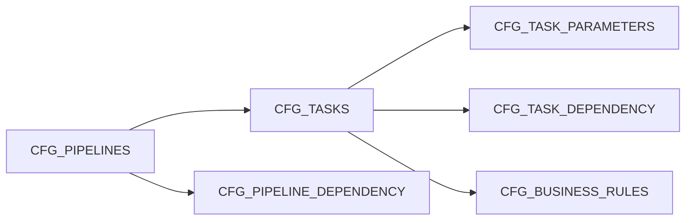

# Pipelines and tasks

A pipeline is rows in the Engine DB's `CFG_` tables, which your team writes (by SQL, a migration
of its own, or any tool) and etl-craft only reads. Nothing about a pipeline lives in code: to
change one, change its rows, reviewed like any other change, and check them with
[`validate`](validating.md).



Every `CFG_` row has `ACTIVE_FLAG` (`Y` or `N`): setting it to `N` retires the row without
deleting it, and only active rows are read. Codes are unique among active rows, so a retired
pipeline's code can be used again. `CREATED_BY`, `CREATE_DATE`, `UPDATED_BY` and `UPDATED_DATE`
are kept by the database.

The demo's [`metadata/support_insights.sql`](https://github.com/venkatcg00/etl-craft/blob/main/examples/demo/metadata/support_insights.sql)
writes five pipelines this way, and runs as written on SQLite and PostgreSQL.

## `CFG_PIPELINES`

| Column | Holds |
|---|---|
| `PIPELINE_CODE` | the pipeline's code: letters, digits, `_` and `-`. It names the pipeline in every command, DAG id and log folder |
| `PIPELINE_NAME` | a readable name |
| `DESCRIPTION` | what the pipeline is for; the [catalog](catalog.md) leads its page with it |
| `RUN_SCHEDULE` | a cron expression, written into the pipeline's generated DAG |
| `SLA_IN_HOURS` | how long a run may take; each run is marked `MET` or `BREACHED` (see [Running a pipeline](running-pipelines.md#sla)) |
| `REFRESH_TYPE` | `FULL` or `INCREMENTAL`; SQL tasks read it through [`$$pipeline_id_filter`](sql-tasks.md) |
| `PIPELINE_PARAMETERS` | a JSON object of the generated DAG's settings (below) |

`PIPELINE_PARAMETERS` holds the settings of the pipeline's generated DAG, each overriding the
`Orchestration` defaults in `craft-connector.yml`:

| Key | Value |
|---|---|
| `CATCHUP`, `DEPENDS_ON_PAST`, `EMAIL_ON_FAILURE` | `true` or `false` |
| `RETRIES`, `RETRY_DELAY_MINUTES` | a whole number, 0 or more |
| `TAGS`, `EMAIL_RECIPIENTS` | a list of strings |

`EMAIL_RECIPIENTS` also receives the pipeline's SLA emails. A value of the wrong type fails
`validate`; a key etl-craft does not read is a warning.

## `CFG_TASKS`

| Column | Holds |
|---|---|
| `PIPELINE_ID` | the pipeline the task belongs to |
| `TASK_CODE` | the task's code, unique in its pipeline: letters, digits, `_` and `-` |
| `TASK_TYPE` | `INGESTION` (it brings data in) or `ETL` (it works on data already in); shown by `steps` and the catalog |
| `HANDLER` | what runs the task (below) |
| `RUN_CONDITION`, `RUN_CONDITION_COUNT` | how many of its dependencies must be satisfied: `ALL` (the default, when `NULL`), `ANY`, or `N` with a count; see [Dependencies and run conditions](dependencies.md) |

| `HANDLER` | Runs | Guide |
|---|---|---|
| `SQL` | one read-only SELECT, wrapped by the engine in one of eight write actions | [SQL tasks](sql-tasks.md) |
| `PYTHON` | an ingestion script from `ingestion_scripts/` | [Ingestion scripts](ingestion-scripts.md) |
| `BUSINESS_RULES` | the task's rows of `CFG_BUSINESS_RULES`, flagging the rows that break them | [Business rules](business-rules.md) |
| `EMAIL_ALERT` | an email about the run so far | [Email alerts](email-alerts.md) |

## `CFG_TASK_PARAMETERS`

A task's settings are name and value rows, one per `PARAMETER_NAME` among its active rows. Each
handler's guide lists the ones it reads. Every task may also set:

| Parameter | Value |
|---|---|
| `TASK_TIMEOUT_SECONDS` | the task's time limit, overriding `Orchestration.Task_timeout_seconds`; `0` for none |
| `DOCUMENTATION` | what the task does; kept in versions by [`docs-version`](lineage.md) and shown in the catalog |

A parameter no handler reads is a `validate` warning, with the nearest names, except on `PYTHON`
tasks, whose scripts may read any.

## `CFG_TASK_DEPENDENCY` and `CFG_PIPELINE_DEPENDENCY`

The order of the work comes from these rows, never from code. A `CFG_TASK_DEPENDENCY` row makes
`TASK_ID` wait on `DEPENDS_ON_TASK_ID`, in its own pipeline or, with `DEPENDS_ON_PIPELINE_ID`,
in another; a `CFG_PIPELINE_DEPENDENCY` row makes a pipeline wait on another. Each has a
`DEPENDENCY_TYPE`: `SUCCESS`, `FAILURE`, `ALWAYS` or `HAS_DATA`. See
[Dependencies and run conditions](dependencies.md).

## An example

A pipeline that loads orders and then checks them, on SQLite or PostgreSQL:

```sql
INSERT INTO CFG_PIPELINES (PIPELINE_CODE, PIPELINE_NAME, DESCRIPTION, REFRESH_TYPE, RUN_SCHEDULE)
VALUES ('SALES_DAILY', 'Daily sales', 'Loads yesterday''s orders and checks them.', 'FULL',
        '0 6 * * *');

INSERT INTO CFG_TASKS (TASK_CODE, TASK_TYPE, PIPELINE_ID, HANDLER)
SELECT v.column1, v.column2, p.PIPELINE_ID, v.column3
FROM (VALUES ('load_orders', 'ETL', 'SQL'), ('check_orders', 'ETL', 'BUSINESS_RULES')) v
JOIN CFG_PIPELINES p ON p.PIPELINE_CODE = 'SALES_DAILY' AND p.ACTIVE_FLAG = 'Y';

INSERT INTO CFG_TASK_PARAMETERS (TASK_ID, PARAMETER_NAME, PARAMETER_VALUE)
SELECT t.TASK_ID, v.column1, v.column2
FROM (VALUES ('SQL_ACTION', 'OVERWRITE_TABLE'),
             ('TARGET_OBJECT', 'sales.orders'),
             ('SOURCE_SQL_FILE', 'orders.sql')) v
JOIN CFG_PIPELINES p ON p.PIPELINE_CODE = 'SALES_DAILY' AND p.ACTIVE_FLAG = 'Y'
JOIN CFG_TASKS t ON t.PIPELINE_ID = p.PIPELINE_ID AND t.TASK_CODE = 'load_orders'
                AND t.ACTIVE_FLAG = 'Y';

INSERT INTO CFG_TASK_DEPENDENCY (PIPELINE_ID, TASK_ID, DEPENDS_ON_TASK_ID, DEPENDENCY_TYPE)
SELECT c.PIPELINE_ID, c.TASK_ID, l.TASK_ID, 'SUCCESS'
FROM CFG_PIPELINES p
JOIN CFG_TASKS c ON c.PIPELINE_ID = p.PIPELINE_ID AND c.TASK_CODE = 'check_orders'
JOIN CFG_TASKS l ON l.PIPELINE_ID = p.PIPELINE_ID AND l.TASK_CODE = 'load_orders'
WHERE p.PIPELINE_CODE = 'SALES_DAILY'
  AND p.ACTIVE_FLAG = 'Y' AND c.ACTIVE_FLAG = 'Y' AND l.ACTIVE_FLAG = 'Y';
```

`etl-craft graph --pipeline_code SALES_DAILY` shows its order. `etl-craft validate
--pipeline_code SALES_DAILY` says what is still missing before it can run:

```text
[FAIL] SALES_DAILY.check_orders: task check_orders has HANDLER=BUSINESS_RULES but no active row in CFG_BUSINESS_RULES
[FAIL] SALES_DAILY.load_orders: SOURCE_SQL_FILE='orders.sql': no such file .../sql_files/orders.sql
checked 1 pipeline(s) and 2 task(s): 2 failed, 0 warning(s)
```

Add `sql_files/orders.sql` with the SELECT (see [SQL tasks](sql-tasks.md)) and a rule for
`check_orders` (see [Business rules](business-rules.md)), and `etl-craft run --pipeline_code
SALES_DAILY` runs it.
