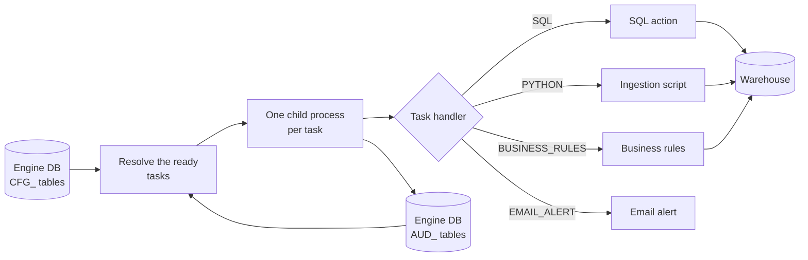
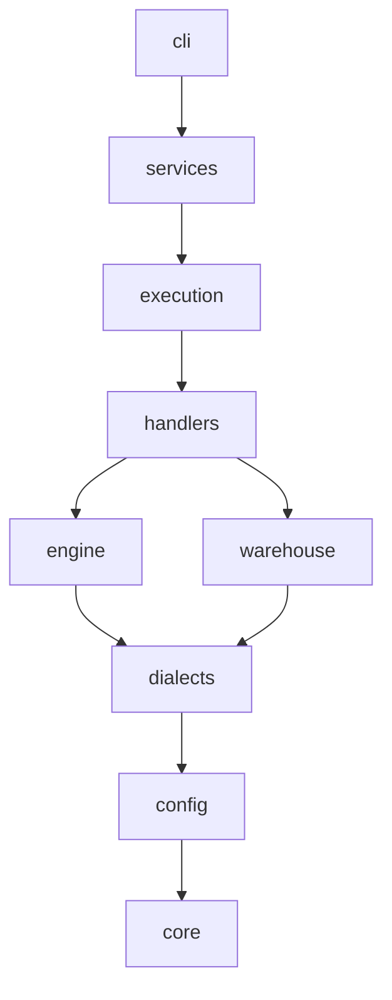

# etl-craft

etl-craft is a metadata-driven ETL orchestration engine. Pipelines, their tasks and the
dependencies between them are rows in a database, the **Engine DB**. etl-craft reads those rows
and runs the work against one **warehouse**. It runs pipelines by itself, or it generates a DAG
description for an orchestrator such as Airflow to schedule.

!!! note "Pre-release"
    etl-craft is being rebuilt ahead of its first release, 0.1.0. Pages marked as planned are
    written as the features reach the new code base; progress is tracked in the
    [rewrite plan](development/rewrite-plan.md).

## Core ideas

**Pipelines are data, not code.** A pipeline is a row in `CFG_PIPELINES`; its tasks are rows in
`CFG_TASKS`; the order between them comes from `CFG_TASK_DEPENDENCY` and
`CFG_PIPELINE_DEPENDENCY`. Changing a pipeline means changing rows, reviewed like any other
change.

**One verb runs everything.** `etl-craft run --pipeline_code X` runs a pipeline in dependency
waves, one child process per task. `etl-craft run --pipeline_code X --task_code Y` runs one task;
it is the command a generated orchestrator DAG calls for each step.

**Runs resolve themselves.** A run's id is never passed between tasks. Each task finds the
pipeline's active run in `AUD_PIPELINES_RUN_LOG`, and the database guarantees there is only one.
A retry resumes the run: tasks that already succeeded are not run again.

**The engine owns every write.** A SQL task supplies a read-only `SELECT`. The engine wraps it
in one of seven actions (`CREATE_TABLE`, `SETUP_TABLE`, `OVERWRITE_TABLE`, `SCD1_MERGE`,
`SCD2_MERGE`, `DROP_TABLE`, `DELETE_ROWS`) and adds the audit columns the action needs.

**Two databases.** The Engine DB (SQLite for local use, PostgreSQL in production) holds
configuration and audit tables. The warehouse (PostgreSQL, DuckDB, Trino over Iceberg,
Databricks or Snowflake) holds your data.

## How a run works

Each finished task records its outcome in `AUD_TASK_RUN_LOG`; the next wave is resolved from
those outcomes and the dependency rows.

## How the code is organised

Each package imports only the packages below it. The [Python API](api/etl_craft/index.md)
reference is generated from the code.
